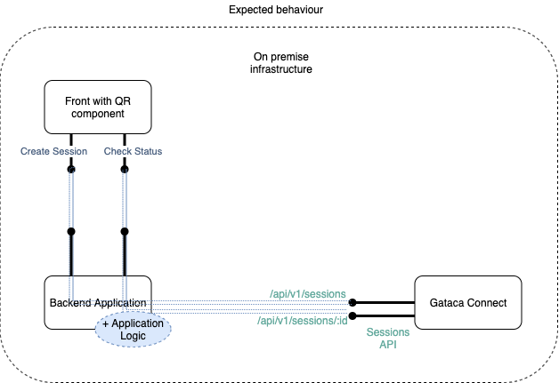
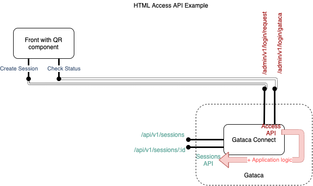
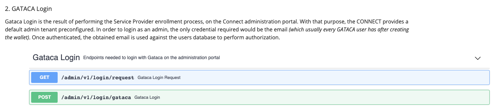

# Gataca-QR

This component built using stencyl allows an easy integration to display a gataca QR.
You only need to install on a front component to scan presentation requests from the (Gataca Wallet)[https://gataca.io/solutions] app.

## Installing this component

### Script tag
- Put a script tag similar to this `<script src='https://unpkg.com/gatacaqr@1.0.1/dist/gatacaqr.js'></script>` in the head of your index.html
- Then you can use the element anywhere in your template, JSX, html etc

### Node Modules
- Run `npm install gatacaqr --save`
- Put a script tag similar to this `<script src='node_modules/gatacaqr/dist/gatacaqr.js'></script>` in the head of your index.html
- Then you can use the element anywhere in your template, JSX, html etc

## Styles & Personification

It allows to integrate 2 slots, named "title" and "description", to provide further integration to the user upon display of the QR.

## Usage

It allows to integrate 2 slots, named "title" and "description", to provide further integration to the user upon display of the QR.

This component can be used with the prerequisite of having an application which can be integrated with [Gataca Connect](https://docs.gatacaid.com/connect/). More precisely, your application will need to be able to perform the two operations against your connect server:
1. Create sessions
2. Consult sessions



Therefore, in order to make it work, you will need at least:
1. A **connect server** (might be Gataca Connect Saas)
2. An application integrated with that server to perform the basic operations.

You can find an example of that kind of simple application _(written in Go)_ on the [Gataca Authorizer](https://github.com/gatacaid/gataca-authorizer), which we will use as example to explain the component's usage. *Gataca Authorizer* offers the two required endpoints:

1. **/validate** : _Check if the user is authenticated, if not, create a new session against the connect server_
2. **/login** : _Check the status of the created session_

Continuing with that example, you could integrate with that kind of application _(if running on http://localhost:9009)_ using the following code

````html
<!DOCTYPE html>
<html dir="ltr" lang="en">

<head>
    <meta charset="utf-8">
    <meta name="viewport" content="width=device-width, initial-scale=1.0, minimum-scale=1.0, maximum-scale=5.0">
    <title>Gataca QR Component</title>
    <script src='https://unpkg.com/gatacaqr@1.1.3/dist/gatacaqr.js'></script>
    <style type="text/css">
        .qrTitle {
            color: #181B5E;
            align-self: center;
            text-align: center;
        }

        .qrDesc {
            color: #181B5E;
        }
    </style>
</head>

<body>
    <gataca-qr id="gataca-qr" callback-server="https://connect.dev.gatacaid.com:9090" session-endpoint="http://localhost:9009/login?id=" qr-modal-title="Easy login" qr-modal-description="Scan this QR to open your gataca wallet" button-text="Easy login">

    <script>
        const qr = document.getElementById('gataca-qr');
        const qrTitle = document.getElementById('qrTitle');
        const RESULT_STATUS = {
            ONGOING: 0,
            SUCCESS: 1,
            FAILED: 2,
        }
        let appToken = "";
        let sessionToken = "";

        //Change this variables with your installation
        const appName = "$YOUR_APP";
        const tenant = "$YOUR_TENANT";
        const appPassword = "$YOUR_PASSWORD";
        const connectServer = "$YOUR_SERVER";

        qr.callbackServer = connectServer;

        const getAppToken = async () => {
            if (!appToken) {
                let response = await fetch(
                    connectServer + "/admin/v1/login/basic",
                    {
                        method: "POST",
                        headers: {
                            'Content-Type': 'application/json',
                            'Tenant': tenant,
                            'Authorization': 'Basic ' + btoa(appName + ":" + appPassword)
                        },
                        body: "{}"
                    })
                appToken = response.headers.get('Token')
                return appToken
            }
            return appToken
        }

        qrTitle.onClick = (e) => {
            qr.open = false;
        }


        const processData = (data) => {
            let result = {}
            for (let vc of data?.verifiableCredential) {
                for (let key of Object.keys(vc.credentialSubject)) {
                    if (key != "id") {
                        result[key] = vc.credentialSubject[key]
                    }
                }
            }
            return result
        }

        qr.createSession = async () => {
            let endpoint = connectServer + "/api/v1/sessions";
            let response = await fetch(
                endpoint,
                {
                    method: "POST",
                    headers: {
                        'Content-Type': 'application/json',
                        'Authorization': 'jwt ' + await getAppToken()
                    },
                    body: "{}"
                })
            let data = await response.json();
            sessionToken = response.headers.get('Token');
            return data.id
        }

        qr.checkStatus = async (id) => {
            let endpoint = connectServer + '/api/v1/sessions/' + id;
            let response = await fetch(
                endpoint,
                {
                    headers: {
                        'Content-Type': 'application/json',
                        'Authorization': 'jwt ' + sessionToken,
                    }
                }
            );
            let data = response.status === 200 ? (await response.json()).data : null;
            if (data) {
                qr.sessionData = processData(data)
            }
            return response.status === 200 ? RESULT_STATUS.SUCCESS : response.status === 204 ? RESULT_STATUS.ONGOING : RESULT_STATUS.FAILED;
        }

        qr.successCallback = (data, token) => {
            alert("LOGIN OK: " + qr.sessionData["some_info_field_you_requested"]) //the session data has mapped the required credentials. You can invoke whichever you need here, depending on what you requested on the tenant configuration.
        };
        qr.errorCallback = () => {
            alert("Wrong credentials!")
        };
    </script>
</body>

</html>
````

#### HTML Only with the standard interface

This example shows how to integrate the QR Component on a normal scenario, on the easiest case: the application server exposes the same interface as the Access API on the GATACA Connect.

To understand the GATACA Connect Access API, this diagram could help:


As you can see from the diagram, the Access API performs an internal call to the sessions API to generate and validate sessions. The retrieved information is then mapped with our business logic to perform authorization and generate tokens if needed.

The definition of the default interface is can be found on the [Gataca Connect documentation](https://docs.gataca.io/connect//#access):


The first request - _the gataca login request_- is the default session generation endpoint, whereas the second one -_Gataca Login_- Post response is the session consultation endpoint.

The pseudo-code of those functions in the case of the AccessAPI, that could easily be adapted to your needs, is the following:

````go
func loginRequest(request, response) {
    sessionID, token = connectService.CreateSession(session)  // connectService implements the invocation to the sessionsAPI, including the required app authentication
    cipheredToken = cipher(token)                             // the token is ciphered so it cannot be used by the user or anyone else directly against the connect server if leaked
    response.Header.Set("connect_token", token)               // token and session_id are returned in both header or response body
    response.Header.Set("session_id", sessionID)
    response = {
        "session_id":    sessionID,
        "connect_token": connectToken,
    }
    return response.writeJSON(http.StatusOK, response)
}

func loginGataca(request, response) error {
    sessionID = request.Header.Get("session_id")                          // recover token and session_id
    connectToken = request.Header.Get("connect_token")
    decipheredToken = decipher(token)                                     // decipher the previously ciphered token 
    data, finish_code = connectService.GetSessionData(session, token)     // connectService implements the API Call to validate the session against the Sessions API
    if (finish_code = 204) {
       return response.writeJSON(http.StatusPreconditionRequired,"")      // Empty session: returns HTTP code 428
    } else if (finish_code = 200) {
       dataProcessed = extractData(data)                                  // Valid session: we can process the response credentials and validate the data with our own business logic or authenticate
       token = validateDataAndAuthenticate(dataProcessed)
       response.setToken(token)
       return response.writeJSON(http.StatusOK, {"data": dataProcessed})  // Return processed data on a free format to be used and presented by the front
    } else {
       return response.writeJSON(http.StatusError, "")                    // Invalid session, return an error to the front
    }
}
````
__Note:__ _The default values provided for demo will always result in rejected sessions, as it is controlled by the gataca access application logic: the authentication using verifiable credentials will be successful whereas the authorization against our business logic will be rejected._

The example configuration of the QR if your application implements the standard API is very simple:
````html
<!DOCTYPE html>
<html dir="ltr" lang="en">
<head>
  <meta charset="utf-8">
  <meta name="viewport" content="width=device-width, initial-scale=1.0, minimum-scale=1.0, maximum-scale=5.0">
  <title>Gataca QR Component</title>
  <script src='https://unpkg.com/gatacaqr@1.1.2/dist/gatacaqr.js'></script>
  <style type="text/css">
  .qrTitle {
      color: #181B5E;
      align-self: center;
      text-align: center;
  }
  .qrDescription {
      color: #181B5E;
  }
  </style>
</head>
<body>
  <gataca-qr id="gataca-qr" session-timeout="300" polling-frequency="3" generation-endpoint ='https://connect.gataca.io:9090/admin/v1/login/request'
session-endpoint = "https://connect.gataca.io:9090/admin/v1/login/gataca">
      <h1 class="qrTitle" slot="title" id="qrTitle">Login with Gataca</h1>
      <h5 class="qrDesc" slot="description">Scan this QR to open your gataca wallet</h5>
  </gataca-qr>
  
  <script>
    const qr = document.getElementById('gataca-qr');
    const qrTitle = document.getElementById('qrTitle');
    qrTitle.onClick = (e) => {
        qr.open = false;
    }
    qr.successCallback = (data, token) => {
        alert("LOGIN OK: " + data)
    };
    qr.errorCallback = () => {
        alert("Wrong credentials!")
    };
  </script>
</body>
</html>
````

___ Note: ___  _The following examples explain how to use certain configuration parameters depending on your application needs_

#### Application rendering HTML Only
This example shows how to integrate the QR Component on a normal scenario, where the application defines its own interface for the services.

You can find an example of that kind of simple application _(written in Go)_ on the [Gataca Authorizer](https://github.com/gatacaid/gataca-authorizer), which we will use as example to explain the component's usage. 
*Gataca Authorizer* creates the sessionId before rendering the page and provides it as a parameter on the HTML template. To query the status of the session, it offers the following endpoint:

* **/login/status** : _Check the status of the created session_

Continuing with the example as before, you could integrate with that kind of application - _running at $APP_DOMAIN_- by modifying the following pieces of code

1. Add JQuery Library in HEAD
````html
<head>
...
<script src="https://cdnjs.cloudflare.com/ajax/libs/jquery/3.2.1/jquery.min.js"></script>
...
</head>
`````

2. Modify the parameters of the QR to present the connect server and the session id renderized on the HTML template when loaded by the backend.
````html
<body>
  ...
  <gataca-qr id="gataca-qr" callback-server="{{.ConnectServer}}" session-id="{{.SessionId}}">
  ...
</body>
`````

3. Include a checkStatus implementation to retrieve the session data.
````html
  <script>
    const qr = document.getElementById('gataca-qr');
    ....
    qr.checkStatus = async (id) => {
        console.log("Check status called for session", id)
        try {
            response = await $.get("login/status")
            console.log("Got Status Response", response)
            qr.sessionData = (await response.json()).data;
            return 1;
        } catch (err) {
            console.log("Error", err)
            switch (err.status) {
                case 428:
                    return 0;
                default:
                    return 2
            }
        }
    }
 ...   
  </script>
````
__Note__: If you want to retrieve the data on the successCallback, you need to store on the _checkStatus_ invocation the session data in the _sessionData_ property from the qr

__Note 2__: If *Gataca Authorizer* also had an endpoint to generate the sessionId, and in case we wanted that the sessionId is not generated before serving the HTML file, but when clicking the button, we could do it just by modifying the previous example:

1. Modify the parameters of the QR to remove the session-id parameter.
````html
<body>

  ...
  <gataca-qr id="gataca-qr" callback-server="{{.ConnectServer}}">
  ...
</body>
`````
2. Include a _createSession_ implementation to retrieve the session data.
````html
  <script>
    const qr = document.getElementById('gataca-qr');
    ....
    qr.createSession = async (id) => {
        //Invoke token generation endpoint
    }
 ...
  </script>
````

In order to consult sessions, both options are also available, depending on how you want to develop your own API: either checkStatus method or the sessionEndpoint if your API matches the expecter authorizer API.


## Properties

| Property             | Attribute             | Description                                                                                                                                                                                                                                                                                                                                         | Type                                      | Default                       |
| -------------------- | --------------------- | --------------------------------------------------------------------------------------------------------------------------------------------------------------------------------------------------------------------------------------------------------------------------------------------------------------------------------------------------- | ----------------------------------------- | ----------------------------- |
| `sessionId`          | `session-id`          | _[Optional]_ Generated session Id, which is required. Without session Id, the QR will not work. If the property is unset, it will check for an _id_ or _sessionId_ query parameter on the current URL. If there is no sessionId, it will fallback to the createSession method to generate a new Session.↓                                            | `string`                                  | -                   |
| `createSession`      | --                    | _[Optional]_ Create session function to generate a new Session If the property is unset, it will fallback to the generation Endpoint property.↓                                                                                                                                                                                                      | `() => Promise<string>`                   | `undefined`                   |
| `generationEndpoint` | `generation-endpoint` | _[Optional]_ Session Generation URL to create a new Session. It will expect to receive the session Id from the response header 'X-Connect-Id'. If not set, it would use a default endpoint to the same window URL under the path /auth                                                                                                              | `string`                                  | `https://$DOMAIN:9090/admin/v1/login/request` |
| `checkStatus`        | --                    | _[Optional]_ Check status function to query the current status of the session If not set, it would fallback to the session Endpoint property. ↓                                                                                                                                                                                                      | `(id?: string) => Promise<RESULT_STATUS>` | `undefined`                   |
| `sessionEndpoint`    | `session-endpoint`    | _[Optional]_ EndpointURL to fetch data for the status. The endpoint URL will send a GET request with the session id on a parameter; concatenated to this string. It can be used if your API fulfills the requirement. If not, use the checkStatus property. If not set, it would use a default endpoint to the same window URL under the path /auth | `string`                                  | `https://$CURRENT_DOMAIN:9090/admin/v1/login/gataca`    |
| `successCallback`    | --                    | ***Mandatory*** Callback fired upon session correctly verified If not set, session validation wouldn't trigger any action The session data and a possible token will be sent as parameters to the callback                                                                                                                                          | `(data?: any, token?: string) => void`    | -                   |
| `errorCallback`      | --                    | ***Mandatory*** Callback fired upon session expired or invalid If not set, session error would not be handled An error containing information will be passed as parameter                                                                                                                                                                           | `(error?: Error) => void`                 | -                   |
| `callbackServer`     | `callback-server`     | ***Mandatory*** Connect Server where the wallet will send the data                                                                                                                                                                                                                                                                                  | `string`                                  | `https://connect.gatacaid.com:9090`     |
| `pollingFrequency`   | `polling-frequency`   | _[Optional]_ Frequency in seconds to check if the session has been validated                                                                                                                                                                                                                                                                        | `number`                                  | 3        |
| `sessionTimeout`     | `session-timeout`     | _[Optional]_ Maximum time window to display the session                                                                                                                                                                                                                                                                                             | `number`                                  | 180     |
| `dynamicLink`        | `dynamic-link`        | _[Optional]_ Display a link containing a dynamic link to invoke the wallet if closed                                                                                                                                                                                                                                                                | `boolean`                                 | `true`                        |
| `generationEndpoint` | `generation-endpoint` | _[Optional]_ Session Generation URL to create a new Session. It will expect to receive the session Id from the response header 'X-Connect-Id'. If not set, it would use a default endpoint to the same window URL under the path /auth                                                                                                              | `string`                                  | `DEFAULT_GENERATION_ENDPOINT` |
| `sessionEndpoint`    | `session-endpoint`    | _[Optional]_ EndpointURL to fetch data for the status. The endpoint URL will send a GET request with the session id on a parameter; concatenated to this string. It can be used if your API fulfills the requirement. If not, use the checkStatus property. If not set, it would use a default endpoint to the same window URL under the path /auth | `string`                                  | `DEFAULT_SESSION_ENDPOINT`    |
| `sessionTimeout`     | `session-timeout`     | _[Optional]_ Maximum time window to display the session                                                                                                                                                                                                                                                                                             | `number`                                  | `DEFAULT_SESSION_TIMEOUT`     |
| `qrModalTitle`    | `qr-modal-title`                    | _[Optional]_ Text that is shown to personalise the message of the qr modal.                                                                                                                                       | `string`                   |
| `qrModalDescription`    | `qr-modal-description`                    | _[Optional]_ Text to personalise the qr modal description to explain the user what need to be done with the QR code.                                                                                                                              | `string`                   |
| `buttonText`    | `button-text                    | _[Optional]_ Text of the button.                                                                                                                                | `string`                   |
| `qrRole`             | `qr-role`             | _[Optional]_ Decide if scanning the credential as a verifier to request credentials or as an issuer too issue credentials. ___Options:___ __scan _(default)_ \| credential__                                                                                                                                                                                    | `string`                                  | `scan`         |
| `asButton`           | `as-button`           | _[Optional]_ Decide if to show it as a button to display the QR Or display directly the QR. Default: true (display button)                                                                                                                                                                                                                          | `boolean`                                 | `true`                        |


## Events

| Event                  | Description                                                                | Type               |
| ---------------------- | -------------------------------------------------------------------------- | ------------------ |
| `gatacaLoginCompleted` | GatacaLoginCompleted event, triggered with session data upon login success | `CustomEvent<any>` |
| `gatacaLoginFailed`    | GatacaLoginFailed event, triggered with error upon login failure           | `CustomEvent<any>` |


## Methods

### `display() => Promise<void>`

Force manually the display of a QR

#### Returns

Type: `Promise<void>`


### `getSessionData() => Promise<any>`

Retrieve manually the session data on a successful login

#### Returns

Type: `Promise<any>`


### `getToken() => Promise<string>`

Retrieve manually a possible token retrieved upon login on the Header 'token'

#### Returns

Type: `Promise<string>`


### `stop() => Promise<void>`

Stop manually an ongoing session

#### Returns

Type: `Promise<void>`

----------------------------------------------

### Javascript invocation

You can display or hide the displayed QR by setting it's _open_ state property.

### Overriding styles

TBD...

*Built with [StencilJS](https://stenciljs.com/)*
