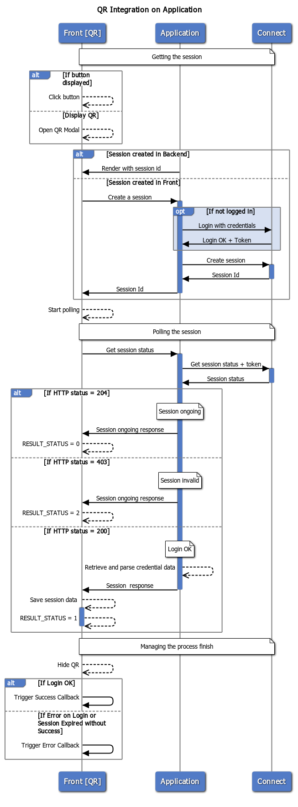
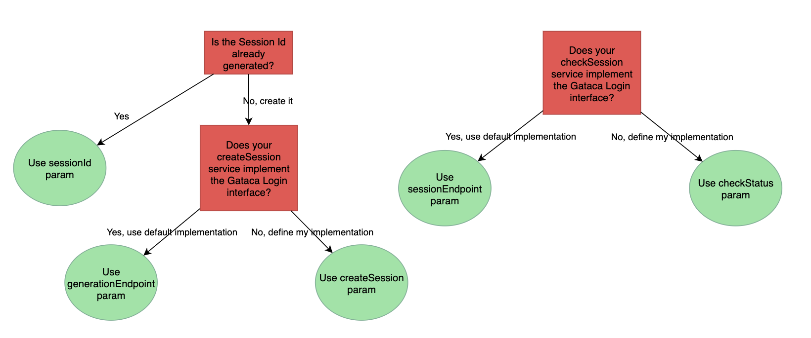

# Gataca-QR

This component built using stencyl allows an easy integration to display a gataca QR.
You only need to install on a front component to scan presentation requests from the (Gataca Wallet)[https://gataca.io/solutions] app.

## Installing this component

### Script tag
- Put a script tag similar to this `<script src='https://unpkg.com/gatacaqr@1.1.2/dist/gatacaqr.js'></script>` in the head of your index.html
- Then you can use the element anywhere in your template, JSX, html etc

### Node Modules
- Run `npm install gatacaqr --save`
- Put a script tag similar to this `<script src='node_modules/gatacaqr/dist/gatacaqr.js'></script>` in the head of your index.html
- Then you can use the element anywhere in your template, JSX, html etc

## Styles & Personification

It allows to integrate 2 slots, named "title" and "description", to provide further integration to the user upon display of the QR.

## Usage

This component should be used with the prerequisite of having an application which can be integrated with [Gataca Connect](https://docs.gatacaid.com/connect/). More precisely, your application will need to be able to perform the two operations against your connect server:
1. Create sessions
2. Consult sessions

Therefore, in order to make it work, you will need at least:
1. A **connect server** 
2. An application integrated with that server to perform the basic operations.

Note: Direct integration with [Gataca Connect](https://docs.gatacaid.com/connect/) is not recommended and should be used only for demo purposes.

To better understand how the QR works, this diagram details its work:



### Configurations

To understand all possible configurations. Check the properties section below. Here is a recap of all possible combinations:

1. You can choose if to generate a QR used for scanning credentials or to issue new credentials, by setting the _qrRole_ property to __scan__ or __credential__ respectively.
2. You need to configure a _callbackServer_ to display on the QR, so that the wallet knows the location of the server to share the data with.
3. a. You can use this component with an already created session, which can be inserted on the sessionId property on the element, or passed via query parameter _id_ or _sessionId_ on the current URL.
b. If you want the event of pushing the button to trigger the creation of the session, you can also provide a method to generate a new session providing the 
_createSession_ property.
c. If your application matches the gataca-login interface, you can avoid defining your own implementation and use the default implementation just by providing the _generationEndpoint_.
4. a. If you have defined your own service to get the session on the connect, you should implement a _checkStatus_ property. The method needs to return 0, 1 or 2 depending if the credential sharing process is still ongoing, succesfully finished or finished with error respectively.
b. If your application matches the gataca-login interface, you can avoid defining your own implementation and use the default implementation just by providing the _sessionEndpoint_.
c. You can optionally configure your own frequency for the polling and the session expiration time with the _pollingFrequency_ and _sessionTimeout_ properties.
5. To keep the logic on your client-side, your shall configure the _sucessCallback_ and the _errorCallback_ properties, to implement alerts, redirections or further logic upon the ending of the process.
6. You can choose to display the component as a button or avoid to display the button and manually trigger the QR using the _asButton_ property. To manually trigger the QR, use javascript to invoke the _open()_ method
7. You can choose not display a dynamic link and make the QR lighter by setting the _dynamicLink_ property to false, but it is not recommended for better compatibility and user experience.

To better understand the different relation between properties, this decision diagram explains the relation between them:



You can also check the examples below to check which configuration is more suitable for your case.

### Examples

#### HTML Only
This example shows how to integrate the QR Component on a normal scenario, on the easiest case: the application server exposes the same interface as the Gataca Login Module.

````html
<!DOCTYPE html>
<html dir="ltr" lang="en">
<head>
  <meta charset="utf-8">
  <meta name="viewport" content="width=device-width, initial-scale=1.0, minimum-scale=1.0, maximum-scale=5.0">
  <title>Gataca QR Component</title>
  <script src='https://unpkg.com/gatacaqr@1.1.2/dist/gatacaqr.js'></script>
  <style type="text/css">
  .qrTitle {
      color: #181B5E;
      align-self: center;
      text-align: center;
  }
  .qrDesc {
      color: #181B5E;
  }
  </style>
</head>
<body>
  <gataca-qr id="gataca-qr" session-timeout="300" polling-frequency="3" generation-endpoint ='https://connect.gataca.io:9090/admin/v1/login/request'
session-endpoint = "https://connect.gataca.io:9090/admin/v1/login/gataca">
      <h1 class="qrTitle" slot="title" id="qrTitle">Login with Gataca</h1>
      <h5 class="qrDesc" slot="description">Scan this QR to open your gataca wallet</h5>
  </gataca-qr>
  
  <script>
    const qr = document.getElementById('gataca-qr');
    const qrTitle = document.getElementById('qrTitle');
    qrTitle.onClick = (e) => {
        qr.open = false;
    }
    qr.successCallback = (data, token) => {
        alert("LOGIN OK: " + data)
    };
    qr.errorCallback = () => {
        alert("Wrong credentials!")
    };
  </script>
</body>
</html>
````

The definition of the default interface is can be found on the [Gataca Connect documentation](https://docs.gataca.io/connect//#access):


The first request - _the gataca login request_- is the default session generation endpoint, whereas the second one -_Gataca Login_- Post response is the session consultation endpoint.

__Note:__ _The default values provided for demo will always result in rejected sessions._

#### Application rendering HTML Only
This example shows how to integrate the QR Component on a normal scenario, where the application defines its own interface for the services.

You can find an example of that kind of simple application _(written in Go)_ on the [Gataca Authorizer](https://github.com/gatacaid/gataca-authorizer), which we will use as example to explain the component's usage. 
*Gataca Authorizer* creates the sessionId before rendering the page and provides it as a parameter on the HTML template. To query the status of the session, it offers the following endpoint:

* **/login/status** : _Check the status of the created session_

Continuing with the example as before, you could integrate with that kind of application - _running at $APP_DOMAIN_- by modifying the following pieces of code

1. Add JQuery Library in HEAD
````html
<head>
...
<script src="https://cdnjs.cloudflare.com/ajax/libs/jquery/3.2.1/jquery.min.js"></script>
...
</head>
`````

2. Modify the parameters of the QR to present the connect server and the session id renderized on the HTML template when loaded by the backend.
````html
<body>
  ...
  <gataca-qr id="gataca-qr" callback-server="{{.ConnectServer}}" session-id="{{.SessionId}}">
  ...
</body>
`````

3. Include a checkStatus implementation to retrieve the session data.
````html
  <script>
    const qr = document.getElementById('gataca-qr');
    ....
    qr.checkStatus = async (id) => {
        console.log("Check status called for session", id)
        try {
            response = await $.get("login/status")
            console.log("Got Status Response", response)
            qr.sessionData = (await response.json()).data;
            return 1;
        } catch (err) {
            console.log("Error", err)
            switch (err.status) {
                case 428:
                    return 0;
                default:
                    return 2
            }
        }
    }
 ...   
  </script>
````
__Note__: If you want to retrieve the data on the successCallback, you need to store on the _checkStatus_ invocation the session data in the _sessionData_ property from the qr

__Note 2__: If *Gataca Authorizer* also had an endpoint to generate the sessionId, and in case we wanted that the sessionId is not generated before serving the HTML file, but when clicking the button, we could do it just by modifying the previous example:

1. Modify the parameters of the QR to remove the session-id parameter.
````html
<body>

  ...
  <gataca-qr id="gataca-qr" callback-server="{{.ConnectServer}}">
  ...
</body>
`````
2. Include a _createSession_ implementation to retrieve the session data.
````html
  <script>
    const qr = document.getElementById('gataca-qr');
    ....
    qr.createSession = async (id) => {
        //Invoke token generation endpoint
    }
 ...
  </script>
````

#### SPA React Application

In this example, we will show how to integrate it with a full react application.

1. Run `npm install gatacaqr --save`
2. In _index.js_, include the following code at the beggining:
````javascript
import { applyPolyfills, defineCustomElements } from 'gatacaqr/loader';

applyPolyfills().then(() => {
  defineCustomElements(window);
});
````
3. Create a JS component to use the QR or just invoke it from your component:
````javascript
import React, { useEffect, useState, useRef } from 'react'

export const QRLogin: React.FC = () => {
  const qr = useRef(null)

  const gatacaLoginSuccess = (data: any, token: string) => {
    alert('Gataca Login Successful')
  }

  const gatacaLoginError = error => {
    alert('Gataca Login Error')
  }

  useEffect(() => {
    qr.current.generationEndpoint =
      process.env.REACT_APP_CONNECT_HOST + '/admin/v1/login/request'
    qr.current.sessionEndpoint =
      process.env.REACT_APP_CONNECT_HOST + '/admin/v1/login/gataca'
    qr.current.successCallback = gatacaLoginSuccess
    qr.current.errorCallback = gatacaLoginError
  }, [username, password])

  return (<gataca-qr
                callback-server={process.env.REACT_APP_CONNECT_HOST}
                ref={qr}
                polling-frequency="15"/>
  )
}
````


## Properties
| Property             | Attribute             | Description                                                                                                                                                                                                                                                                                                                                         | Type                                      | Default                       |
| -------------------- | --------------------- | --------------------------------------------------------------------------------------------------------------------------------------------------------------------------------------------------------------------------------------------------------------------------------------------------------------------------------------------------- | ----------------------------------------- | ----------------------------- |
| `sessionId`          | `session-id`          | _[Optional]_ Generated session Id, which is required. Without session Id, the QR will not work. If the property is unset, it will check for an _id_ or _sessionId_ query parameter on the current URL. If there is no sessionId, it will fallback to the createSession method to generate a new Session.↓                                            | `string`                                  | -                   |
| `createSession`      | --                    | _[Optional]_ Create session function to generate a new Session If the property is unset, it will fallback to the generation Endpoint property.↓                                                                                                                                                                                                      | `() => Promise<string>`                   | `undefined`                   |
| `generationEndpoint` | `generation-endpoint` | _[Optional]_ Session Generation URL to create a new Session. It will expect to receive the session Id from the response header 'X-Connect-Id'. If not set, it would use a default endpoint to the same window URL under the path /auth                                                                                                              | `string`                                  | `https://$DOMAIN:9090/admin/v1/login/request` |
| `checkStatus`        | --                    | _[Optional]_ Check status function to query the current status of the session If not set, it would fallback to the session Endpoint property. ↓                                                                                                                                                                                                      | `(id?: string) => Promise<RESULT_STATUS>` | `undefined`                   |
| `sessionEndpoint`    | `session-endpoint`    | _[Optional]_ EndpointURL to fetch data for the status. The endpoint URL will send a GET request with the session id on a parameter; concatenated to this string. It can be used if your API fulfills the requirement. If not, use the checkStatus property. If not set, it would use a default endpoint to the same window URL under the path /auth | `string`                                  | `https://$CURRENT_DOMAIN:9090/admin/v1/login/gataca`    |
| `successCallback`    | --                    | ***Mandatory*** Callback fired upon session correctly verified If not set, session validation wouldn't trigger any action The session data and a possible token will be sent as parameters to the callback                                                                                                                                          | `(data?: any, token?: string) => void`    | -                   |
| `errorCallback`      | --                    | ***Mandatory*** Callback fired upon session expired or invalid If not set, session error would not be handled An error containing information will be passed as parameter                                                                                                                                                                           | `(error?: Error) => void`                 | -                   |
| `callbackServer`     | `callback-server`     | ***Mandatory*** Connect Server where the wallet will send the data                                                                                                                                                                                                                                                                                  | `string`                                  | `https://connect.gatacaid.com:9090`     |
| `pollingFrequency`   | `polling-frequency`   | _[Optional]_ Frequency in seconds to check if the session has been validated                                                                                                                                                                                                                                                                        | `number`                                  | 3        |
| `sessionTimeout`     | `session-timeout`     | _[Optional]_ Maximum time window to display the session                                                                                                                                                                                                                                                                                             | `number`                                  | 180     |
| `dynamicLink`        | `dynamic-link`        | _[Optional]_ Display a link containing a dynamic link to invoke the wallet if closed                                                                                                                                                                                                                                                                | `boolean`                                 | `true`                        |
| `qrRole`             | `qr-role`             | _[Optional]_ Decide if scanning the credential as a verifier to request credentials or as an issuer too issue credentials. ___Options:___ __scan _(default)_ \| credential__                                                                                                                                                                                    | `string`                                  | `scan`         |
| `asButton`           | `as-button`           | _[Optional]_ Decide if to show it as a button to display the QR Or display directly the QR. Default: true (display button)                                                                                                                                                                                                                          | `boolean`                                 | `true`                        |

## Events

| Event                  | Description                                                                | Type               |
| ---------------------- | -------------------------------------------------------------------------- | ------------------ |
| `gatacaLoginCompleted` | GatacaLoginCompleted event, triggered with session data upon login success | `CustomEvent<any>` |
| `gatacaLoginFailed`    | GatacaLoginFailed event, triggered with error upon login failure           | `CustomEvent<any>` |


## Methods

### `display() => Promise<void>`

Force manually the display of a QR

#### Returns

Type: `Promise<void>`


### `getSessionData() => Promise<any>`

Retrieve manually the session data on a successful login

#### Returns

Type: `Promise<any>`


### `getToken() => Promise<string>`

Retrieve manually a possible token retrieved upon login on the Header 'token'

#### Returns

Type: `Promise<string>`


### `stop() => Promise<void>`

Stop manually an ongoing session

#### Returns

Type: `Promise<void>`

----------------------------------------------

### Javascript invocation

You can display or hide the displayed QR by setting it's _open_ state property.

### Overriding styles

TBD...

*Built with [StencilJS](https://stenciljs.com/)*
