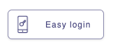

# Gataca-QR Components

Since V2, this library is now a list of components provided by Gataca to help the integration of its backends components into your front services.

To use this components (except for the QR Display), you will need an instance of any of the Gataca Components (Connect and Certify). You can also use it with onPremise instances over Gataca Studio.

## [Gataca QRDisplay](src/components/gataca-qrdisplay/readme.md)
Just to display QRs with the Gataca format in any required component

## [Gataca QR](src/components/gataca-qr/readme.md)
Main component of the library. It has been reworked and simplified, while keeping all it's flexibility.

It displays a qr as an overflow panel to integrate into your site. It requires that you have a backend service integrated with Gataca Connect or Certify.


See its documentation for integration.

## [Gataca QRWS](src/components/gataca-qrwsreadme.md)

This is another version of the QR supporting WebSockets instead of a constant polling to your service.
It enables a more updated an elegant architecture, but the complexity gets transported to your backend service which will need to handle the polling or support an Event-oriented architecture.

## [Gataca SSIButton](src/components/gataca-ssibutton/readme.md)

This flavour supports the easy login button to integrate into your site instead of a panel.
The integration and parameters are analogue to the GatacaQR.



## [Gataca SSIButtonWS](src/components/gataca-ssibuttonws/readme.md)

Same as the SSI Button, but with Websockets :)
The integration and parameters are analogue to the GatacaQR.

## [Gataca QRAuto](src/components/gataca-qrdisplay/readme.md)

````note
WIP
````

This component allows to simplify the integration by downloading all the configuration from a remote server.
However, the integration steps and functions of the selected subcomponent need to be still implemented and provided to the component.

