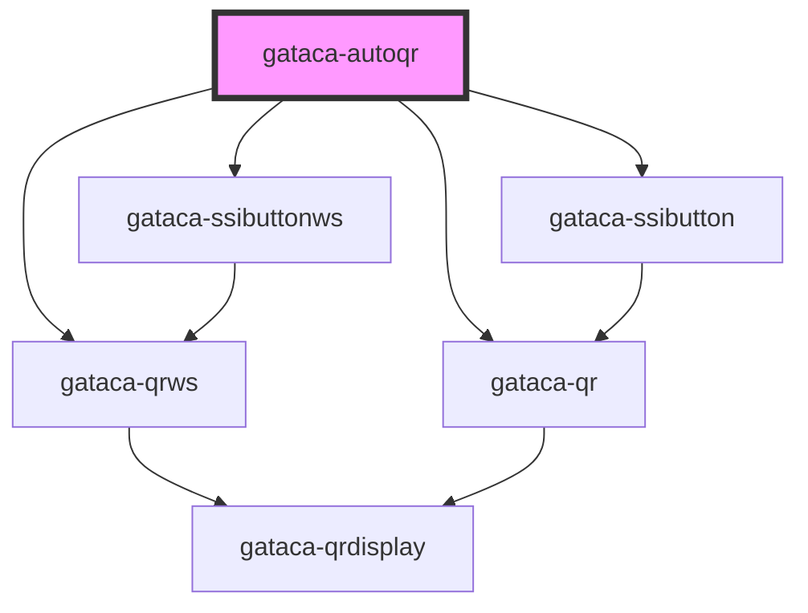

# Gataca-AutoQR

This component built using stencyl allows an easy integration to display a GatacaQR using a predefined generated config that is downloaded when the component is displayed.

An AutoQR Config has the following structure:

```typescript
export type QRConfig = {
  useButton: boolean;
  useWs: boolean;

  //To display any QR
  qrModalTitle?: string;
  qrModalDescription?: string;
  hideBrandTitle?: boolean;

  successCallback: (data?: any) => void;
  errorCallback: (error?: Error) => void;

  autostart: boolean;
  autorefresh: boolean;
  sessionTimeout?: number;

  qrRole: string;
  callbackServer: string;
  v2?: boolean;
  dynamicLink?: boolean;

  //Just for Polling
  checkStatus?: (id?: string) => Promise<{ result: RESULT_STATUS; data?: any }>;
  createSession?: () => Promise<{
    sessionId: string;
    authenticationRequest?: string;
  }>;
  pollingFrequency?: number;

  //Just for WS
  socketEndpoint: string;
  wsOnOpen?: (socket: WebSocket) => void;
  wsOnMessage?: (socket: WebSocket, msg: MessageEvent) => void;

  //Just for Buttons
  buttonText?: string;
};
```

Depending on the parameters **useWs** and **useButton**, it will automatically load the corresponding component of the 4 possible options, with all the configuration loaded.

| **useButton** \ **useWs** | _false_: Using Polling    | _true_: Using Websockets |
|---|---|---|
| _false_: Displaying the QR | [Gataca QR](../gataca-qr/readme.md)   |  [Gataca QRWS](../gataca-qrws/readme.md) |
| _true_: Displaying an SSI Button | [Gataca SSIButton](../gataca-ssibutton/readme.md)  | [Gataca SSIButtonWS](../gataca-ssibuttonws/readme.md)  |

## Integrations

For integration, just refer to the documentation of the selected component.

It is noted that while supported on the config, it is RECOMMENDED that the function parameters are defined and implemented locally when inserting the autoqr component. Defining them remotely will allow for remote code injection.

#### Example

Look for the best suitable example on each of the components. 

The pure JS integration of the most basic case, with polling and without button, could look like this:

````html
<!DOCTYPE html>
<html dir="ltr" lang="en">
<head>
  <meta charset="utf-8">
  <meta name="viewport" content="width=device-width, initial-scale=1.0, minimum-scale=1.0, maximum-scale=5.0">
  <title>Gataca Auto QR Component</title>
  <script type="module" src="/build/gatacaqr.esm.js"></script>
  <script nomodule src="/build/gatacaqr.js"></script>
</head>
<body>

<div>
  <gataca-autoqr id="gataca-qr" configId="your_config_id"> <!-- TODO Change with your config id-->
  </gataca-autoqr>
</div>

<script>
  const qr = document.getElementById('gataca-qr');
  var count = 0;
  var ok = true; 

  qr.successCallback = (data) => {
    //TODO Change with what you want to happen when the session is validated
    alert("ALL OK" + data)
  };
  qr.errorCallback = () => {
    //TODO Change with what you want to happen when the session is expired or the user provides invalid credentials
    alert("some error")
  };

  qr.createSession = () => {
    // TODO Change with an invocation to your service to create a session (either v1 or v2)
    // Authentication request is required only for v2
    return { sessionId: "TWp3V2R1N29ZcmFMY3Nvd3ZPb3k0UlMz", authenticationRequest:"" }
  }

  qr.checkStatus = () => {
    //TODO Change with and invocation to your Backend service to query the status of the session
    count++;
    if (count == 10) {
      return { result: ok ? 1 : 2, data: { "name": "test", "token": "x" } }
    }
    return { result: 0 }
  }
</script>

</body>
</html>
````

<!-- Auto Generated Below -->


## Properties

| Property           | Attribute           | Description                                                                                                                                                                                                                                                                                                                                                                 | Type                                                                    | Default              |
| ------------------ | ------------------- | --------------------------------------------------------------------------------------------------------------------------------------------------------------------------------------------------------------------------------------------------------------------------------------------------------------------------------------------------------------------------- | ----------------------------------------------------------------------- | -------------------- |
| `checkStatus`      | --                  | ___Just for polling flavour___ ***Mandatory*** Check status function to query the current status of the session The function must query a client endpoint to check the status. That endpoint must return an error if the session has expired.                                                                                                                               | `(id?: string) => Promise<{ result: RESULT_STATUS; data?: any; }>`      | `undefined`          |
| `configId`         | `config-id`         | ***Mandatory*** ID of the QR configuration to display                                                                                                                                                                                                                                                                                                                       | `string`                                                                | `undefined`          |
| `configRepository` | `config-repository` | ___Optional___ ConfigURL Repository to download the config from                                                                                                                                                                                                                                                                                                             | `string`                                                                | `DEFAULT_REPOSITORY` |
| `createSession`    | --                  | ***Mandatory*** Create session function to generate a new Session Using V1, it can provide just a session Id Using V2, it must provide also the authentication request. The session Id is the id of the presentation definition                                                                                                                                             | `() => Promise<{ sessionId: string; authenticationRequest?: string; }>` | `undefined`          |
| `errorCallback`    | --                  | ___Just for polling flavour___ ***Mandatory*** Callback fired upon session expired or invalid If not set, session error would not be handled An error containing information will be passed as parameter                                                                                                                                                                    | `(error?: Error) => void`                                               | `undefined`          |
| `successCallback`  | --                  | ***Mandatory*** Callback fired upon session correctly verified If not set, session validation wouldn't trigger any action The session data and a possible token will be sent as parameters to the callback                                                                                                                                                                  | `(data?: any) => void`                                                  | `undefined`          |
| `wsOnMessage`      | --                  | ___Just for WS flavour___ **RECOMMENDED** Callback to invoke an a message has been received on the socket. It provides the socket itself and the message as parameters. If not used, the messages provided by the server on the Socket connection must conform to the WSReponse interface If used, an Event named **sessionMsg** must be triggered with a WSReponse as data | `(socket: WebSocket, msg: MessageEvent<any>) => void`                   | `undefined`          |
| `wsOnOpen`         | --                  | ___Just for WS flavour___ [Optional] Function to send a message to the server upon socket creation                                                                                                                                                                                                                                                                          | `(socket: WebSocket) => void`                                           | `undefined`          |


## Events

| Event                  | Description                                                                | Type               |
| ---------------------- | -------------------------------------------------------------------------- | ------------------ |
| `gatacaLoginCompleted` | GatacaLoginCompleted event, triggered with session data upon login success | `CustomEvent<any>` |
| `gatacaLoginFailed`    | GatacaLoginFailed event, triggered with error upon login failure           | `CustomEvent<any>` |


## Methods

### `getSessionData() => Promise<any>`

Retrieve manually the session data on a successful login

#### Returns

Type: `Promise<any>`


## Dependencies

### Depends on

- [gataca-ssibuttonws](../gataca-ssibuttonws)
- [gataca-ssibutton](../gataca-ssibutton)
- [gataca-qrws](../gataca-qrws)
- [gataca-qr](../gataca-qr)

### Graph


----------------------------------------------

*Built with [StencilJS](https://stenciljs.com/)*
