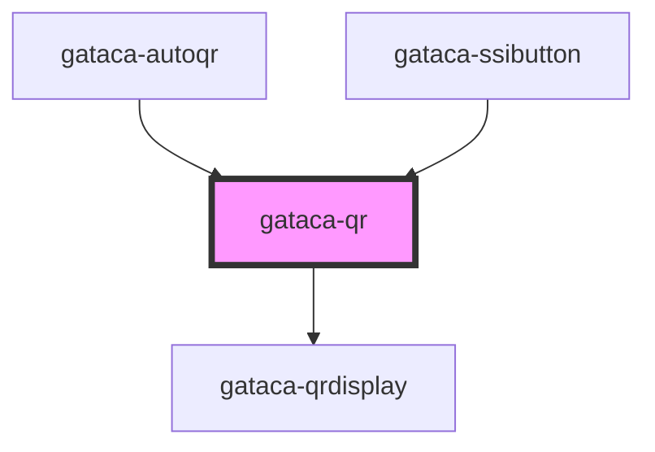

# Gataca-QR

This component built using stencyl allows an easy integration to display a gataca QR to be read by the wallet.

This component can be used with the prerequisite of having an application which can be integrated with GATACA Components: Connect and Certify. More precisely, your application will need to be able to perform the two operations against your connect or certify servers:

1. Create sessions
2. Consult sessions

## Integrations

### Pure JS

You can include the components by importing the library, available on NPM:

#### Script tag

Put a script tag similar to the source [https://unpkg.com/gatacaqr/dist/gatacaqr.js](https://unpkg.com/gatacaqr/dist/gatacaqr.js) in the head of your index.html. Check for the last version:

```html
<!DOCTYPE html>
<html dir="ltr" lang="en">
  <head>
    <meta charset="utf-8" />
    <meta
      name="viewport"
      content="width=device-width, initial-scale=1.0, minimum-scale=1.0, maximum-scale=5.0"
    />
    <script
      type="module"
      src="https://unpkg.com/@gataca/qr@2.0.1/dist/gatacaqr/gatacaqr.esm.js"
    ></script>
    <script
      nomodule=""
      src="https://unpkg.com/@gataca/qr@2.0.1/dist/index.js"
    ></script>
  </head>
  ...
</html>
```

#### Example

```html
<!DOCTYPE html>
<html dir="ltr" lang="en">
  <head>
    <meta charset="utf-8" />
    <meta
      name="viewport"
      content="width=device-width, initial-scale=1.0, minimum-scale=1.0, maximum-scale=5.0"
    />
    <title>Gataca QR Component</title>
    <script
      type="module"
      src="https://unpkg.com/@gataca/qr@2.0.1/dist/gatacaqr/gatacaqr.esm.js"
    ></script>
    <script
      nomodule=""
      src="https://unpkg.com/@gataca/qr@2.0.1/dist/index.js"
    ></script>
  </head>
  <body>
    <div>
      <gataca-qr
        id="gataca-qr"
        qrRole="connect"
        callback-server="https://connect.gataca.io"
      >
        <!-- TODO Change with your connect server-->
      </gataca-qr>
    </div>

    <script>
      const qr = document.getElementById("gataca-qr");
      var count = 0;
      var ok = true;

      qr.successCallback = (data) => {
        //TODO Change with what you want to happen when the session is validated
        alert("ALL OK" + data);
      };
      qr.errorCallback = () => {
        //TODO Change with what you want to happen when the session is expired or the user provides invalid credentials
        alert("some error");
      };

      qr.createSession = () => {
        // Authentication request is required
        return {
          sessionId: "TWp3V2R1N29ZcmFMY3Nvd3ZPb3k0UlMz",
          authenticationRequest: "",
        };
      };

      qr.checkStatus = () => {
        //TODO Change with and invocation to your Backend service to query the status of the session
        count++;
        if (count == 10) {
          return { result: ok ? 1 : 2, data: { name: "test", token: "x" } };
        }
        return { result: 0 };
      };
    </script>
  </body>
</html>
```

You can use this component with an already created session, which can be inserted on the sessionId property on the element, or passed via query parameter _id_ or _sessionId_ on the current URL.
You can also provide a method to generate a new session like in the example, or, in the rare event of matching the authorizer API, just the endpoint to your application.

In order to consult sessions, both options are also available, depending on how you want to develop your own API.

### React App Integration

Import the library

```bash
npm install @gataca/qr --save
```

or

```bash
yarn add @gataca/qr
```

In your base file index.js (or index.tsx), include:

```typescript
import { applyPolyfills, defineCustomElements } from "@gataca/qr/loader";

//before ReactDOM.render
applyPolyfills().then(() => {
  defineCustomElements(window);
});
```

The integration would depend if your using a Class Component or a Function Component. Supposing a function component (adaptation to class components is trivial), you would need to include:

```typescript
type MyProps = {
    ...
    verifier?: boolean
    configId?: string
    appToken?: string
}


export const dummyComponent: React.FC<MyProps> = (props) => {
  ...
  const { verifier, appToken, configId } = props
  const qr = useRef(null)
  let gqr: HTMLGatacaQrElement | undefined

  useEffect(() => {
            if (qr != null && qr.current != null) {
                gqr = qr.current! as HTMLGatacaQrElement
                gqr.createSession = createSession
                gqr.checkStatus = checkStatus
                gqr.successCallback = createSessionSuccess
                gqr.errorCallback = createSessionError
        }
    })


    //TODO Implement your own service logic invocation. This is just a dummy mimicking the Connect/Certify v1 APIs asuming you get an app token in props
     const createSession = async (): Promise<{
        sessionId: string
        authenticationRequest?: string
    }> => {
        try {
            let endpoint =
                server +
                (verifier ? '/api/v1/sessions' : '/api/v1/issuanceRequests')
            let response = await fetch(endpoint, {
                method: 'POST',
                headers: {
                    'Content-Type': 'application/json',
                    Authorization: 'jwt ' + appToken,
                },
                body: verifier
                    ? '{"ssiConfigId": "' + configId + '"}'
                    : '{"group": "' + configId + '"}',
            })
            let data = await response.json()
            return { sessionId: data.id! }
        } catch (error) {
            setSessionErrorState(true)
            throw error
        }
    }

    const checkStatus = async (): Promise<{
        result: RESULT_STATUS
        data?: any
    }> => {
        //TODO Implement your own service logic invocation. This is just a dummy mimicking the Connect/Certify v1 APIs asuming you get an app token in props
        if (!appToken || error) {
            gqr?.stop()
        }
        const endpoint =
            server +
            (verifier ? '/api/v1/sessions/' : '/admin/v1/issuanceRequests/') +
            sessionId
        let response = await fetch(endpoint, {
            method: 'GET',
            headers: {
                Authorization: 'jwt ' + appToken,
                'Content-Type': 'application/json',
            },
        })

        if (verifier) {
            let req = await response
            return req.status === 200
                ? { result: RESULT_STATUS.SUCCESS }
                : req.status === 204
                ? { result: RESULT_STATUS.ONGOING }
                : { result: RESULT_STATUS.FAILED }
        } else {
            let req = await response.json()
            return !req.status || req.status === 'PENDING'
                ? { result: RESULT_STATUS.ONGOING }
                : req.status === 'INVALID'
                ? { result: RESULT_STATUS.FAILED }
                : { result: RESULT_STATUS.SUCCESS }
        }
    }

    const createSessionSuccess = (newdata: any) => {
        //TODO Handle success
    }

    const createSessionError = (error: any) => {
        //TODO Handle ERROR
    }

  //render() function in class components
  return (
      // @ts-ignore
      <gataca-qr
          callback-server={ verifier ? YOUR_CONNECT_HOST: YOUR_CERTIFY_HOST }
          ref={qr}
          qr-role={verifier ? "connect":"certify"}
      />
  )

}
```

### Angular App Integration

TBD

## Updating from V1

There are some breaking changes to V2:

- _sessionEndpoint_ and _generationEndpoint_ have been suppressed.
- _createSession_ and _checkStatus_ functions are now mandatory. The returning parameters of those functions have now changed.
- _qrRole_ is also mandatory. There is no default value. The possible values have changed to "**connect**" and "**certify**"
- _asButton_ and _buttonText_ functionality has been suppressed. That is a different component.
- _getLoginToken()_ has been suppressed. Any data that wants to be received from the session (from headers, body or whatever) must be provided by the _checkStatus_ result function.
- _sessionTimeout_ can be removed by introducing a negative value. If removed, the QR will wait until the server provides an error by session expiration.

Improvements:

- Logs have been cleaned
- Fix providing feedback on the process result and results either if it expires, fails or successes.
- Stopping the component working upon disappearance
- Autostart and autorefresh capabilities
- Documentation and integration with the new provided components

<!-- Auto Generated Below -->


## Properties

| Property                       | Attribute                           | Description                                                                                                                                                                                                                                     | Type                                                                    | Default                                                               |
| ------------------------------ | ----------------------------------- | ----------------------------------------------------------------------------------------------------------------------------------------------------------------------------------------------------------------------------------------------- | ----------------------------------------------------------------------- | --------------------------------------------------------------------- |
| `autorefresh`                  | `autorefresh`                       | _[Optional]_ Set to refresh the session automatically upon expiration. By default it is false                                                                                                                                                   | `boolean`                                                               | `false`                                                               |
| `autostart`                    | `autostart`                         | _[Optional]_ Set to enable autoload when the QR is displayed. By default it is true                                                                                                                                                             | `boolean`                                                               | `true`                                                                |
| `byBrandLabel`                 | `by-brand-label`                    | _[Optional]_ String to show "by brand" label                                                                                                                                                                                                    | `string`                                                                | `"by Gataca"`                                                         |
| `callbackServer`               | `callback-server`                   | ***Mandatory just for V1*** Connect/Certify Server where the wallet will send the data                                                                                                                                                          | `string`                                                                | `undefined`                                                           |
| `checkStatus`                  | --                                  | ***Mandatory*** Check status function to query the current status of the session The function must query a client endpoint to check the status. That endpoint must return an error if the session has expired.                                  | `(id?: string) => Promise<{ result: RESULT_STATUS; data?: any; }>`      | `undefined`                                                           |
| `clickInsideBoxLabel`          | `click-inside-box-label`            | _[Optional]_ String to show "click inside" label                                                                                                                                                                                                | `string`                                                                | `"Click inside the box to"`                                           |
| `createSession`                | --                                  | ***Mandatory*** Create session function to generate a new Session Using v="3", it can provide just a session Id Using another version, it must provide also the authentication request. The session Id is the id of the presentation definition | `() => Promise<{ sessionId: string; authenticationRequest?: string; }>` | `undefined`                                                           |
| `credentialsNotValidatedLabel` | `credentials-not-validated-label`   | _[Optional]_ String to show when credentials not validatedd                                                                                                                                                                                     | `string`                                                                | `"User credentials not validated"`                                    |
| `credsNotValidatedErrorLabel`  | `creds-not-validated-error-label`   | _[Optional]_ String to show "provided credentials not validates" error                                                                                                                                                                          | `string`                                                                | `"Provided user credentials couldn't be validated"`                   |
| `dynamicLink`                  | `dynamic-link`                      | _[Optional]_ Display a link containing a dynamic link to invoke the wallet if closed                                                                                                                                                            | `boolean`                                                               | `true`                                                                |
| `errorCallback`                | --                                  | ***Mandatory*** Callback fired upon session expired or invalid If not set, session error would not be handled An error containing information will be passed as parameter                                                                       | `(error?: Error) => void`                                               | `undefined`                                                           |
| `failedLoginErrorLabel`        | `failed-login-error-label`          | _[Optional]_ String to show "failed login" error                                                                                                                                                                                                | `string`                                                                | `"No successful login"`                                               |
| `hideBrandTitle`               | `hide-brand-title`                  | _[Optional]_ Boolean to show or not show the gataca brand title                                                                                                                                                                                 | `boolean`                                                               | `false`                                                               |
| `hideModalBoxShadow`           | `hide-modal-box-shadow`             | _[Optional]_ Boolean to show or not show the modal title, brandTitle and description                                                                                                                                                            | `boolean`                                                               | `false`                                                               |
| `hideModalTexts`               | `hide-modal-texts`                  | _[Optional]_ Boolean to show or not show the modal title, brandTitle and description                                                                                                                                                            | `boolean`                                                               | `false`                                                               |
| `hideQrModalDescription`       | `hide-qr-modal-description`         | _[Optional]_ Boolean to show or not show the QR Modal description                                                                                                                                                                               | `boolean`                                                               | `false`                                                               |
| `logoSize`                     | `logo-size`                         | _[Optional]_ Size of the logo to display in percentage to the total size [0-1]. 0 means no logo will be displayed. Default is the GATACA logo. Recommended size is around 0.33                                                                  | `number`                                                                | `0`                                                                   |
| `logoSrc`                      | `logo-src`                          | _[Optional]_ Logo to display, just if the logo size is greater than 0. No logo is the GATACA logo.                                                                                                                                              | `string`                                                                | `logoGataca`                                                          |
| `modalHeight`                  | `modal-height`                      | _[Optional]_ Height of the modal                                                                                                                                                                                                                | `number`                                                                | `undefined`                                                           |
| `modalTitleColor`              | `modal-title-color`                 | _[Optional]_ String to set Modal title color                                                                                                                                                                                                    | `string`                                                                | `"#4745B7"`                                                           |
| `modalWidth`                   | `modal-width`                       | _[Optional]_ Width of the modal                                                                                                                                                                                                                 | `number`                                                                | `300`                                                                 |
| `pollingFrequency`             | `polling-frequency`                 | _[Optional]_ Frequency in seconds to check if the session has been validated                                                                                                                                                                    | `number`                                                                | `DEFAULT_POLLING_FREQ`                                                |
| `qrCodeExpiredLabel`           | `qr-code-expired-label`             | _[Optional]_ String to show when qr code expired                                                                                                                                                                                                | `string`                                                                | `"QR Code expired"`                                                   |
| `qrModalDescription`           | `qr-modal-description`              | _[Optional]_ Modifies the Modal description                                                                                                                                                                                                     | `string`                                                                | `"Sign up or sign in by scanning the QR Code with the Gataca Wallet"` |
| `qrModalTitle`                 | `qr-modal-title`                    | _[Optional]_ Modifies the qr headline title                                                                                                                                                                                                     | `string`                                                                | `"Quick Access"`                                                      |
| `qrRole`                       | `qr-role`                           | ***Mandatory just for V1*** Decide if scanning the credential as a verifier to request credentials or as an issuer too issue credentials. Options: connect \| certify                                                                           | `string`                                                                | `undefined`                                                           |
| `qrSize`                       | `qr-size`                           | _[Optional]_ Size of QR Displayed                                                                                                                                                                                                               | `number`                                                                | `300`                                                                 |
| `qrType`                       | `qr-type`                           | _[Optional]_ Sets the qr type. It can be "svg" or "canvas". "svg" by default.                                                                                                                                                                   | `"canvas" \| "svg"`                                                     | `"svg"`                                                               |
| `readQrDescription`            | `read-qr-description`               | _[Optional]_ String description to show when QR already read                                                                                                                                                                                    | `string`                                                                | `"Please wait a moment"`                                              |
| `readQrTitle`                  | `read-qr-title`                     | _[Optional]_ String title to show when QR already read                                                                                                                                                                                          | `string`                                                                | `"Processing..."`                                                     |
| `refreshQrLabel`               | `refresh-qr-label`                  | _[Optional]_ String to show "refresh QR" label                                                                                                                                                                                                  | `string`                                                                | `"Refresh QR Code"`                                                   |
| `scanQrLabel`                  | `scan-qr-label`                     | _[Optional]_ String to show "scan QR" label                                                                                                                                                                                                     | `string`                                                                | `"Scan QR Code"`                                                      |
| `sessionTimeout`               | `session-timeout`                   | _[Optional]_ Maximum time window to display the session                                                                                                                                                                                         | `number`                                                                | `DEFAULT_SESSION_TIMEOUT`                                             |
| `successCallback`              | --                                  | ***Mandatory*** Callback fired upon session correctly verified If not set, session validation wouldn't trigger any action The session data and a possible token will be sent as parameters to the callback                                      | `(data?: any) => void`                                                  | `undefined`                                                           |
| `successLoginLabel`            | `success-login-label`               | _[Optional]_ String to show "successful login" label                                                                                                                                                                                            | `string`                                                                | `"Successful Connection!"`                                            |
| `userNotScanInTimeErrorLabel`  | `user-not-scan-in-time-error-label` | _[Optional]_ String to show "user not scan in time" error                                                                                                                                                                                       | `string`                                                                | `"User did not scan the QR in the allowed time"`                      |
| `v`                            | `v`                                 | _[Optional]_ If 3, handle deeplink redirects and deprecates (remove) v1 functionality. If not, the create session must be providing both an authentication request and a session Id                                                             | `string`                                                                | `"3"`                                                                 |
| `waitingStartSessionLabel`     | `waiting-start-session-label`       | _[Optional]_ String to show "waiting start session" label                                                                                                                                                                                       | `string`                                                                | `"waiting to start a session"`                                        |


## Events

| Event                  | Description                                                                | Type               |
| ---------------------- | -------------------------------------------------------------------------- | ------------------ |
| `gatacaLoginCompleted` | GatacaLoginCompleted event, triggered with session data upon login success | `CustomEvent<any>` |
| `gatacaLoginFailed`    | GatacaLoginFailed event, triggered with error upon login failure           | `CustomEvent<any>` |


## Methods

### `display() => Promise<void>`

Force manually the display of a QR

#### Returns

Type: `Promise<void>`


### `getSessionData() => Promise<any>`

Retrieve manually the session data on a successful login

#### Returns

Type: `Promise<any>`


### `stop() => Promise<void>`

Stop manually an ongoing session

#### Returns

Type: `Promise<void>`


## Dependencies

### Used by

 - [gataca-autoqr](../gataca-autoqr)
 - [gataca-ssibutton](../gataca-ssibutton)

### Depends on

- [gataca-qrdisplay](../gataca-qrdisplay)

### Graph


----------------------------------------------

*Built with [StencilJS](https://stenciljs.com/)*
