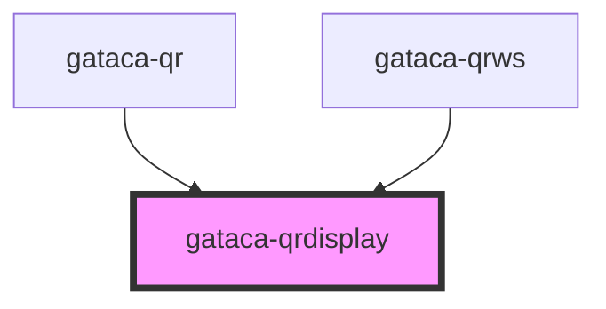

# Gataca-QR Display

This component built using stencyl allows an easy integration to display a QR with the gataca styles

Continuing with that example, you could integrate in any HTML using the following code

```html
<!DOCTYPE html>
<html dir="ltr" lang="en">

<head>
  <meta charset="utf-8">
  <meta name="viewport" content="width=device-width, initial-scale=1.0, minimum-scale=1.0, maximum-scale=5.0">
  <title>Gataca QR Display Component</title>
  <script type="module" src="/build/gataca-qrdisplay.esm.js"></script>
  <script nomodule src="/build/gataca-qrdisplay.js"></script>
</head>

<body>
  <div class="your-container-styles">

    <gataca-qrdisplay id="gataca-qr" qr-data="DATA TO DISPLAY">
      </gataca-qr>

  </div>
</body>

</html>
```

<!-- Auto Generated Below -->

## Properties

| Property                       | Attribute                           | Description                                                                                                                                                                    | Type      | Default                                             |
| ------------------------------ | ----------------------------------- | ------------------------------------------------------------------------------------------------------------------------------------------------------------------------------ | --------- | --------------------------------------------------- | --- | ----------------- | ------------------- | -------------------------------------------- | -------- | ----------- |
| `logoSize`                     | `logo-size`                         | _[Optional]_ Size of the logo to display in percentage to the total size [0-1]. 0 means no logo will be displayed. Default is the GATACA logo. Recommended size is around 0.33 | `number`  | `0`                                                 |
| `logoSrc`                      | `logo-src`                          | _[Optional]_ Logo to display, just if the logo size is greater than 0. No logo is the GATACA logo.                                                                             | `string`  | `undefined`                                         |
| `qrColor`                      | `qr-color`                          | _[Optional]_ QR Color.                                                                                                                                                         | `string`  | `"#1E1E20"`                                         |
| `qrData`                       | `qr-data`                           | _[Mandatory]_ Sets the contents of the QR                                                                                                                                      | `string`  | `undefined`                                         |
| `rounded`                      | `rounded`                           | _[Optional]_ Round usage                                                                                                                                                       | `boolean` | `true`                                              |
| `size`                         | `size`                              | _[Optional]_ Size of the QR Displayed                                                                                                                                          | `number`  | `256`                                               |     | `modalTitleColor` | `modal-title-color` | _[Optional]_ String to set Modal title color | `string` | `"#4745B7"` |
| `logoSize`                     | `logo-size`                         | _[Optional]_ Size of the logo to display in percentage to the total size [0-1]. 0 means no logo will be displayed. Default is the GATACA logo. Recommended size is around.     | `number`  | `0`                                                 |
| `logoSrc`                      | `logo-src`                          | _[Optional]_ Logo to display, just if the logo size is greater than 0. No logo is the GATACA logo.                                                                             | `string`  | `logoGataca`                                        |
| `qrCodeExpiredLabel`           | `qr-code-expired-label`             | _[Optional]_ String to show when qr code expired logo.                                                                                                                         | `string`  | `"QR Code expired"`                                 |
| `credentialsNotValidatedLabel` | `credentials-not-validated-label`   | _[Optional]_ String to show when credentials not validated.                                                                                                                    | `string`  | `"User credentials not validated"`                  |
| `clickInsideBoxLabel`          | `click-inside-box-label`            | _[Optional]_ String to show tring to show \"click inside\" label.                                                                                                              | `string`  | `"Click inside the box to"`                         |
| `refreshQrLabel`               | `refresh-qr-label`                  | _[Optional]_ String to show \"refresh QR\" label"                                                                                                                              | `string`  | `"Refresh QR Code"`                                 |
| `scanQrLabel`                  | `scan-qr-label`                     | _[Optional]_ String to show \"scan QR\" label                                                                                                                                  | `string`  | `"Scan QR Code"`                                    |
| `userNotScanInTimeErrorLabel`  | `user-not-scan-in-time-error-label` | _[Optional]_ String to show \"user not scan in time\" error                                                                                                                    | `string`  | `"User did not scan the QR in the allowed time"`    |
| `credsNotValidatedErrorLabel`  | `creds-not-validated-error-label`   | _[Optional]_ String to show \"provided credentials not validates\" error                                                                                                       | `string`  | `"Provided user credentials couldn't be validated"` |
| `failedLoginErrorLabel`        | `failed-login-error-label`          | _[Optional]_ String to show \"failed login\" error                                                                                                                             | `string`  | `"No successful login"`                             |
| `successLoginLabel`            | `success-login-label`               | _[Optional]_ String to show \"successful login\" label                                                                                                                         | `string`  | `"Successful Connection!"`                          |
| `byBrandLabel`                 | `by-brand-label`                    | _[Optional]_ String to show \"by brand\" label                                                                                                                                 | `string`  | `"by Gataca"`                                       |
| `waitingStartSessionLabel`     | `waiting-start-session-label`       | _[Optional]_ String to show \"waiting start session\" label                                                                                                                    | `string`  | `"waiting to start a session"`                      |
| `hideQrModalDescription`       | `hide-qr-modal-description`         | _[Optional]_ Boolean to show or not show the QR Modal description                                                                                                              | `false`   | `false`                                             |

## Dependencies

### Used by

- [gataca-qr](../gataca-qr)
- [gataca-qrws](../gataca-qrws)

### Graph



---

_Built with [StencilJS](https://stenciljs.com/)_
