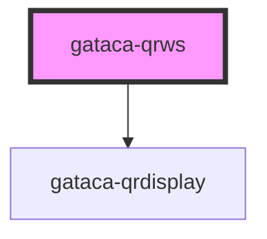

# Gataca-QR

This component built using stencyl allows an easy integration to display a gataca QR.
It allows to integrate 2 slots, named "title" and "description", to provide further integration to the user upon display of the QR.

This component can be used with the prerequisite of having an application which can be integrated with [Gataca Connect](https://docs.gatacaid.com/connect/). More precisely, your application will need to be able to perform the two operations against your connect server:
1. Create sessions
2. Consult sessions

Therefore, in order to make it work, you will need at least:
1. A **connect server** (might be Gataca Connect Saas)
2. An application integrated with that server to perform the basic operations.

You can find an example of that kind of simple application _(written in Go)_ on the [Gataca Authorizer](https://github.com/gatacaid/gataca-authorizer), which we will use as example to explain the component's usage. *Gataca Authorizer* offers the two required endpoints:

1. **/validate** : _Check if the user is authenticated, if not, create a new session against the connect server_
2. **/login** : _Check the status of the created session_

Continuing with that example, you could integrate with that kind of application _(if running on http://localhost:9009)_ using the following code

````html
<!DOCTYPE html>
<html dir="ltr" lang="en">
<head>
  <meta charset="utf-8">
  <meta name="viewport" content="width=device-width, initial-scale=1.0, minimum-scale=1.0, maximum-scale=5.0">
  <title>Gataca QR Component</title>
  <script type="module" src="/build/gatacaqr.esm.js"></script>
  <script nomodule src="/build/gatacaqr.js"></script>
  <script type="module" src="/build/modal.esm.js"></script>
  <script nomodule src="/build/modal.js"></script>
  <style type="text/css">
  h1{
    color: #181B5E;
    align-self: center;
    text-align: center;
  }

  h5{
    color: #181B5E;
  }
  </style>
</head>
<body>
  <gataca-qr id="gataca-qr" callback-server="https://connect.dev.gatacaid.com:9090" session-endpoint="http://localhost:9009/login?id=">
  <h1 slot="title">Login with Gataca</h1>
  <h5 slot="description">Scan this QR to open your gataca wallet</h5></gataca-qr>
  
  <script>
    const qr = document.getElementById('gataca-qr');
    qr.successCallback = () => {
        //replace with your logic
      alert('LOGIN SUCCESS')
    };
    qr.errorCallback = () => {
        //replace with your logic
      alert('LOGIN ERROR')
    };

    qr.createSession = async () => {
        let response = await fetch("http://localhost:9009/validate");
        return response.headers.get("X-Connect-Id")
    }
  </script>
</body>
</html>
````

You can use this component with an already created session, which can be inserted on the sessionId property on the element, or passed via query parameter _id_ or _sessionId_ on the current URL.
You can also provide a method to generate a new session like in the example, or, in the rare event of matching the authorizer API, just the endpoint to your application.

In order to consult sessions, both options are also available, depending on how you want to develop your own API.

<!-- Auto Generated Below -->


## Properties

| Property             | Attribute              | Description                                                                                                                                                                                                                                                                                                                                       | Type                                                  | Default                                                               |
| -------------------- | ---------------------- | ------------------------------------------------------------------------------------------------------------------------------------------------------------------------------------------------------------------------------------------------------------------------------------------------------------------------------------------------- | ----------------------------------------------------- | --------------------------------------------------------------------- |
| `autorefresh`        | `autorefresh`          | _[Optional]_ Set to refresh the session automatically upon expiration. By default it is false                                                                                                                                                                                                                                                     | `boolean`                                             | `false`                                                               |
| `autostart`          | `autostart`            | _[Optional]_ Set to enable autoload when the QR is displayed. By default it is true                                                                                                                                                                                                                                                               | `boolean`                                             | `true`                                                                |
| `callbackServer`     | `callback-server`      | ***Mandatory just for V1*** Connect/Certify Server where the wallet will send the data                                                                                                                                                                                                                                                            | `string`                                              | `undefined`                                                           |
| `dynamicLink`        | `dynamic-link`         | _[Optional]_ Display a link containing a dynamic link to invoke the wallet if closed                                                                                                                                                                                                                                                              | `boolean`                                             | `true`                                                                |
| `errorCallback`      | --                     | ***Mandatory*** Callback fired upon session expired or invalid If not set, session error would not be handled An error containing information will be passed as parameter                                                                                                                                                                         | `(error?: Error) => void`                             | `undefined`                                                           |
| `hideBrandTitle`     | `hide-brand-title`     | _[Optional]_ Boolean to show or not show the gataca brand title                                                                                                                                                                                                                                                                                   | `boolean`                                             | `false`                                                               |
| `qrModalDescription` | `qr-modal-description` | _[Optional]_ Modifies the Modal description                                                                                                                                                                                                                                                                                                       | `string`                                              | `"Sign up or sign in by scanning the QR Code with the Gataca Wallet"` |
| `qrModalTitle`       | `qr-modal-title`       | _[Optional]_ Modifies the qr headline title                                                                                                                                                                                                                                                                                                       | `string`                                              | `"Quick Access"`                                                      |
| `qrRole`             | `qr-role`              | ***Mandatory*** Decide if scanning the credential as a verifier to request credentials or as an issuer too issue credentials. Options: connect \| certify                                                                                                                                                                                         | `string`                                              | `undefined`                                                           |
| `sessionTimeout`     | `session-timeout`      | ***Mandatory*** Maximum time window to display the session and keep the websocket connection. It's needed to ensure the socket is closed.                                                                                                                                                                                                         | `number`                                              | `DEFAULT_SESSION_TIMEOUT`                                             |
| `socketEndpoint`     | `socket-endpoint`      | ***Mandatory*** WS Endpoint on your service to be invoked upon display                                                                                                                                                                                                                                                                            | `string`                                              | `undefined`                                                           |
| `successCallback`    | --                     | ***Mandatory*** Callback fired upon session correctly verified If not set, session validation wouldn't trigger any action The session data and a possible token will be sent as parameters to the callback                                                                                                                                        | `(data?: any) => void`                                | `undefined`                                                           |
| `v2`                 | `v-2`                  | **RECOMMENDED** Set to use v2 links. The create session must be providing both an authentication request and a session Id                                                                                                                                                                                                                         | `boolean`                                             | `false`                                                               |
| `wsOnMessage`        | --                     | **RECOMMENDED** Callback to invoke an a message has been received on the socket. It provides the socket itself and the message as parameters. If not used, the messages provided by the server on the Socket connection must conform to the WSReponse interface If used, an Event named **sessionMsg** must be triggered with a WSReponse as data | `(socket: WebSocket, msg: MessageEvent<any>) => void` | `undefined`                                                           |
| `wsOnOpen`           | --                     | [Optional] Function to send a message to the server upon socket creation                                                                                                                                                                                                                                                                          | `(socket: WebSocket) => void`                         | `undefined`                                                           |


## Events

| Event                  | Description                                                                | Type               |
| ---------------------- | -------------------------------------------------------------------------- | ------------------ |
| `gatacaLoginCompleted` | GatacaLoginCompleted event, triggered with session data upon login success | `CustomEvent<any>` |
| `gatacaLoginFailed`    | GatacaLoginFailed event, triggered with error upon login failure           | `CustomEvent<any>` |


## Methods

### `display() => Promise<void>`

Force manually the display of a QR

#### Returns

Type: `Promise<void>`


### `getSessionData() => Promise<any>`

Retrieve manually the session data on a successful login

#### Returns

Type: `Promise<any>`


### `stop() => Promise<void>`

Stop manually an ongoing session

#### Returns

Type: `Promise<void>`


## Dependencies

### Depends on

- [gataca-qrdisplay](../gataca-qrdisplay)

### Graph


----------------------------------------------

*Built with [StencilJS](https://stenciljs.com/)*
