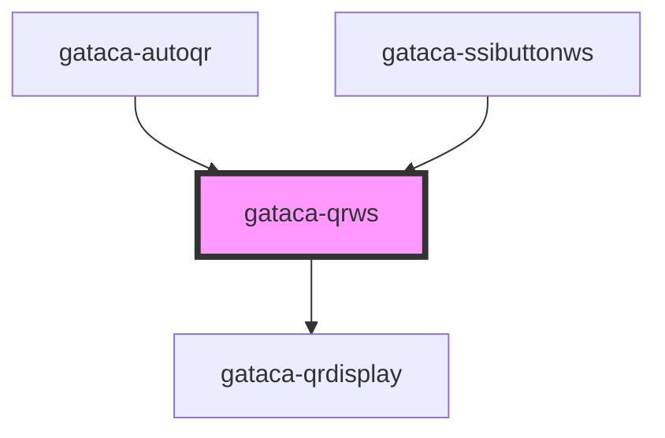

# Gataca-QRWS

This component built using stencyl allows an easy integration to display a gataca QR to be read by the wallet.

It does the same but using WebSockets instead of polling

This component can be used with the prerequisite of having an application which can be integrated with GATACA Components: Connect and Certify. In this case, your application must offer a WebSocket communication.

The websocket service implemented by your service may be completely custom or use the following structure for messages -the type is exported by this library-:

```typescript
export type WSResponse = {
  sessionId: string;
  result: RESULT_STATUS;
  authenticatedUserData?: any;
  authenticationRequest?: string;
  error?: string;
};
```

If your WS Messages implement this interface, you need to know that the QR will start when a WS message is received with result === RESULT_STATUS.ONGOING (0) and a sessionId.
The QR will end when a message with a different result is received, depending on the result.

If your server wants to implement a different interface, there is no problem, but you need to trigger an Event named **sessionMsg** with a matching WSResponse in detail for the QR Component to understand (see examples).


## Integrations

### Pure JS

You can include the components by importing the library, available on NPM:

#### Script tag

Put a script tag similar to the source [https://unpkg.com/gatacaqr/dist/gatacaqr.js](https://unpkg.com/gatacaqr/dist/gatacaqr.js) in the head of your index.html. Check for the last version:

```html
<!DOCTYPE html>
<html dir="ltr" lang="en">
<head>
  <meta charset="utf-8">
  <meta name="viewport" content="width=device-width, initial-scale=1.0, minimum-scale=1.0, maximum-scale=5.0">
  <script src='https://unpkg.com/gatacaqr@2.0.0/dist/gatacaqr.js'></script>
</head>
...
</html>
```

#### Example

````html
<!DOCTYPE html>
<html dir="ltr" lang="en">

<head>
  <meta charset="utf-8">
  <meta name="viewport" content="width=device-width, initial-scale=1.0, minimum-scale=1.0, maximum-scale=5.0">
  <title>Gataca QR Component</title>
  <script type="module" src="/build/gatacaqr.esm.js"></script>
  <script nomodule src="/build/gatacaqr.js"></script>
</head>

<body>

  <div>

    <gataca-qrws id="gataca-qrws" qr-role="connect" session-timeout="300"
      socket-endpoint="ws://your_server"
      callback-server="https://connect.gataca.io">  <!-- TODO Change with your connect server and your service socket-->
    </gataca-qrws>

  </div>

  <script>
    const qr = document.getElementById('gataca-qrws');
    var count = 0;
    var ok = true;

    qr.successCallback = (data) => {
      //TODO Change with what you want to happen when the session is validated
      alert("ALL OK" + data)
    };
    qr.errorCallback = () => {
      //TODO Change with what you want to happen when the session is expired or the user provides invalid credentials
      alert("some error")
    };

    qr.wsOnOpen = (socket) => {
      //TODO Use this if you need a client message to start the session request on your API
      socket.send("SESSION_REQUEST")
    }

    qr.wsOnMessage = (socket, msg) => {
      //TODO Change with and invocation to your Backend web socket to query the status of the session
      let sessionId = "TWp3V2R1N29ZcmFMY3Nvd3ZPb3k0UlMz";
      let wsResponse ={
        sessionId: sessionId;
        result: 0;
      }
      const event = new CustomEvent('sessionMsg', { detail: wsResponse});
      qr..dispatchEvent(event);
      
      //simulation
      setTimeout( () => {
      let wsResponse ={
        sessionId: sessionId;
        result: ok? 1:2;
        error: ok? undefined: "Invalid user data"
      }
      const event = new CustomEvent('sessionMsg', { detail: wsResponse});
      qr..dispatchEvent(event);
      }, 10000)
        
    }

  // (async () => {
  //   await customElements.whenDefined('gataca-qr');
  // })();

  </script>

</body>

</html>
````

You can use this component with an already created session, which can be inserted on the sessionId property on the element, or passed via query parameter _id_ or _sessionId_ on the current URL.
You can also provide a method to generate a new session like in the example, or, in the rare event of matching the authorizer API, just the endpoint to your application.

In order to consult sessions, both options are also available, depending on how you want to develop your own API.

### React App Integration

Import the library

```bash
npm install @gataca/qr --save
```

or

```bash
yarn add @gataca/qr
```

In your base file index.js (or index.tsx), include:

```typescript
import { applyPolyfills, defineCustomElements } from '@gataca/qr/loader'

//before ReactDOM.render
applyPolyfills().then(() => {
    defineCustomElements(window)
})

```

The integration would depend if your using a Class Component or a Function Component. Supposing a function component (adaptation to class components is trivial), you would need to include:

````typescript
type MyProps = {
    ...
    verifier?: boolean
}


export const dummyComponent: React.FC<MyProps> = (props) => {
  ...
  const { verifier } = props
  const qr = useRef(null)
  let gqr: HTMLGatacaQrElement | undefined

  useEffect(() => {
            if (qr != null && qr.current != null) {
                gqr = qr.current! as HTMLGatacaQrElement
                gqr.wsOnOpen = requestSession //Optional
                gqr.wsOnMessage = receiveMessage
                gqr.successCallback = createSessionSuccess
                gqr.errorCallback = createSessionError
        }
    })


    //TODO Implement your own service logic invocation. This is just a dummy. Change with and invocation to your Backend websocket to query the status of the session
     const receiveMessage = async (msg: MessageEvent): => {
      let wsResponse = convertMyAPIMessageToWSResponse(msg)
      const event = new CustomEvent('sessionMsg', { detail: wsResponse});
      qr..dispatchEvent(event);        
    }

    //TODO fix with your API Data
    const convertMyAPIMessageToWSResponse = (msg: MessageEvent) :WSResponse => {
      //Example: session created
      //TODO Process Message and transform to WSResponse object
      return {
          sessionId: 'somesession';
          result: RESULT_STATUS.ONGOING;
        };
    }

      //TODO Use this if you need a client message to start the session request on your API
    const requestSession = (socket) => {
      socket.send("SESSION_REQUEST")
    }

    const createSessionSuccess = (newdata: any) => {
        //TODO Handle success
    }

    const createSessionError = (error: any) => {
        //TODO Handle ERROR
    }

  //render() function in class components
  return (
      // @ts-ignore
      <gataca-qrws
          callback-server={ verifier ? YOUR_CONNECT_HOST: YOUR_CERTIFY_HOST }
          socket-endpoint={YOUR_SERVICE}
          ref={qr}
          qr-role={verifier ? "connect":"certify"}
      />
    )
}
````

### Angular App Integration

TBD


<!-- Auto Generated Below -->


## Properties

| Property                       | Attribute                           | Description                                                                                                                                                                                                                                                                                                                                       | Type                                                  | Default                                                               |
| ------------------------------ | ----------------------------------- | ------------------------------------------------------------------------------------------------------------------------------------------------------------------------------------------------------------------------------------------------------------------------------------------------------------------------------------------------- | ----------------------------------------------------- | --------------------------------------------------------------------- |
| `autorefresh`                  | `autorefresh`                       | _[Optional]_ Set to refresh the session automatically upon expiration. By default it is false                                                                                                                                                                                                                                                     | `boolean`                                             | `false`                                                               |
| `autostart`                    | `autostart`                         | _[Optional]_ Set to enable autoload when the QR is displayed. By default it is true                                                                                                                                                                                                                                                               | `boolean`                                             | `true`                                                                |
| `byBrandLabel`                 | `by-brand-label`                    | _[Optional]_ String to show "by brand" label                                                                                                                                                                                                                                                                                                      | `string`                                              | `"by Gataca"`                                                         |
| `callbackServer`               | `callback-server`                   | ***Mandatory just for V1*** Connect/Certify Server where the wallet will send the data                                                                                                                                                                                                                                                            | `string`                                              | `undefined`                                                           |
| `clickInsideBoxLabel`          | `click-inside-box-label`            | _[Optional]_ String to show "click inside" label                                                                                                                                                                                                                                                                                                  | `string`                                              | `"Click inside the box to"`                                           |
| `credentialsNotValidatedLabel` | `credentials-not-validated-label`   | _[Optional]_ String to show when credentials not validatedd                                                                                                                                                                                                                                                                                       | `string`                                              | `"User credentials not validated"`                                    |
| `credsNotValidatedErrorLabel`  | `creds-not-validated-error-label`   | _[Optional]_ String to show "provided credentials not validates" error                                                                                                                                                                                                                                                                            | `string`                                              | `"Provided user credentials couldn't be validated"`                   |
| `dynamicLink`                  | `dynamic-link`                      | _[Optional]_ Display a link containing a dynamic link to invoke the wallet if closed                                                                                                                                                                                                                                                              | `boolean`                                             | `true`                                                                |
| `errorCallback`                | --                                  | ***Mandatory*** Callback fired upon session expired or invalid If not set, session error would not be handled An error containing information will be passed as parameter                                                                                                                                                                         | `(error?: Error) => void`                             | `undefined`                                                           |
| `failedLoginErrorLabel`        | `failed-login-error-label`          | _[Optional]_ String to show "failed login" error                                                                                                                                                                                                                                                                                                  | `string`                                              | `"No successful login"`                                               |
| `hideBrandTitle`               | `hide-brand-title`                  | _[Optional]_ Boolean to show or not show the gataca brand title                                                                                                                                                                                                                                                                                   | `boolean`                                             | `false`                                                               |
| `hideModalBoxShadow`           | `hide-modal-box-shadow`             | _[Optional]_ Boolean to show or not show the modal title, brandTitle and description                                                                                                                                                                                                                                                              | `boolean`                                             | `false`                                                               |
| `hideModalTexts`               | `hide-modal-texts`                  | _[Optional]_ Boolean to show or not show the modal title, brandTitle and description                                                                                                                                                                                                                                                              | `boolean`                                             | `false`                                                               |
| `hideQrModalDescription`       | `hide-qr-modal-description`         | _[Optional]_ Boolean to show or not show the QR Modal description                                                                                                                                                                                                                                                                                 | `boolean`                                             | `false`                                                               |
| `logoSize`                     | `logo-size`                         | _[Optional]_ Size of the logo to display in percentage to the total size [0-1]. 0 means no logo will be displayed. Default is the GATACA logo. Recommended size is around 0.33                                                                                                                                                                    | `number`                                              | `0`                                                                   |
| `logoSrc`                      | `logo-src`                          | _[Optional]_ Logo to display, just if the logo size is greater than 0. No logo is the GATACA logo.                                                                                                                                                                                                                                                | `string`                                              | `logoGataca`                                                          |
| `modalHeight`                  | `modal-height`                      | _[Optional]_ Height of the modal                                                                                                                                                                                                                                                                                                                  | `number`                                              | `undefined`                                                           |
| `modalTitleColor`              | `modal-title-color`                 | _[Optional]_ String to set Modal title color                                                                                                                                                                                                                                                                                                      | `string`                                              | `"#4745B7"`                                                           |
| `modalWidth`                   | `modal-width`                       | _[Optional]_ Width of the modal                                                                                                                                                                                                                                                                                                                   | `number`                                              | `300`                                                                 |
| `qrCodeExpiredLabel`           | `qr-code-expired-label`             | _[Optional]_ String to show when qr code expired                                                                                                                                                                                                                                                                                                  | `string`                                              | `"QR Code expired"`                                                   |
| `qrModalDescription`           | `qr-modal-description`              | _[Optional]_ Modifies the Modal description                                                                                                                                                                                                                                                                                                       | `string`                                              | `"Sign up or sign in by scanning the QR Code with the Gataca Wallet"` |
| `qrModalTitle`                 | `qr-modal-title`                    | _[Optional]_ Modifies the qr headline title                                                                                                                                                                                                                                                                                                       | `string`                                              | `"Quick Access"`                                                      |
| `qrRole`                       | `qr-role`                           | ***Mandatory*** Decide if scanning the credential as a verifier to request credentials or as an issuer too issue credentials. Options: connect \| certify                                                                                                                                                                                         | `string`                                              | `undefined`                                                           |
| `qrSize`                       | `qr-size`                           | _[Optional]_ Size of QR Displayed                                                                                                                                                                                                                                                                                                                 | `number`                                              | `300`                                                                 |
| `qrType`                       | `qr-type`                           | _[Optional]_ Sets the qr type. It can be "svg" or "canvas". "svg" by default.                                                                                                                                                                                                                                                                     | `"canvas" \| "svg"`                                   | `"svg"`                                                               |
| `readQrDescription`            | `read-qr-description`               | _[Optional]_ String description to show when QR already read                                                                                                                                                                                                                                                                                      | `string`                                              | `"Please wait a moment"`                                              |
| `readQrTitle`                  | `read-qr-title`                     | _[Optional]_ String title to show when QR already read                                                                                                                                                                                                                                                                                            | `string`                                              | `"Processing..."`                                                     |
| `refreshQrLabel`               | `refresh-qr-label`                  | _[Optional]_ String to show "refresh QR" label                                                                                                                                                                                                                                                                                                    | `string`                                              | `"Refresh QR Code"`                                                   |
| `scanQrLabel`                  | `scan-qr-label`                     | _[Optional]_ String to show "scan QR" label                                                                                                                                                                                                                                                                                                       | `string`                                              | `"Scan QR Code"`                                                      |
| `sessionTimeout`               | `session-timeout`                   | ***Mandatory*** Maximum time window to display the session and keep the websocket connection. It's needed to ensure the socket is closed.                                                                                                                                                                                                         | `number`                                              | `DEFAULT_SESSION_TIMEOUT`                                             |
| `socketEndpoint`               | `socket-endpoint`                   | ***Mandatory*** WS Endpoint on your service to be invoked upon display                                                                                                                                                                                                                                                                            | `string`                                              | `undefined`                                                           |
| `successCallback`              | --                                  | ***Mandatory*** Callback fired upon session correctly verified If not set, session validation wouldn't trigger any action The session data and a possible token will be sent as parameters to the callback                                                                                                                                        | `(data?: any) => void`                                | `undefined`                                                           |
| `successLoginLabel`            | `success-login-label`               | _[Optional]_ String to show "successful login" label                                                                                                                                                                                                                                                                                              | `string`                                              | `"Successful Connection!"`                                            |
| `userNotScanInTimeErrorLabel`  | `user-not-scan-in-time-error-label` | _[Optional]_ String to show "user not scan in time" error                                                                                                                                                                                                                                                                                         | `string`                                              | `"User did not scan the QR in the allowed time"`                      |
| `v`                            | `v`                                 | _[Optional]_ If 3, handle deeplink redirects and deprecates (remove) v1 functionality. If not, the create session must be providing both an authentication request and a session Id                                                                                                                                                               | `string`                                              | `"3"`                                                                 |
| `waitingStartSessionLabel`     | `waiting-start-session-label`       | _[Optional]_ String to show "waiting start session" label                                                                                                                                                                                                                                                                                         | `string`                                              | `"waiting to start a session"`                                        |
| `wsOnMessage`                  | --                                  | **RECOMMENDED** Callback to invoke an a message has been received on the socket. It provides the socket itself and the message as parameters. If not used, the messages provided by the server on the Socket connection must conform to the WSReponse interface If used, an Event named **sessionMsg** must be triggered with a WSReponse as data | `(socket: WebSocket, msg: MessageEvent<any>) => void` | `undefined`                                                           |
| `wsOnOpen`                     | --                                  | [Optional] Function to send a message to the server upon socket creation                                                                                                                                                                                                                                                                          | `(socket: WebSocket) => void`                         | `undefined`                                                           |


## Events

| Event                  | Description                                                                | Type               |
| ---------------------- | -------------------------------------------------------------------------- | ------------------ |
| `gatacaLoginCompleted` | GatacaLoginCompleted event, triggered with session data upon login success | `CustomEvent<any>` |
| `gatacaLoginFailed`    | GatacaLoginFailed event, triggered with error upon login failure           | `CustomEvent<any>` |


## Methods

### `display() => Promise<void>`

Force manually the display of a QR

#### Returns

Type: `Promise<void>`


### `getSessionData() => Promise<any>`

Retrieve manually the session data on a successful login

#### Returns

Type: `Promise<any>`


### `stop() => Promise<void>`

Stop manually an ongoing session

#### Returns

Type: `Promise<void>`


## Dependencies

### Used by

 - [gataca-autoqr](../gataca-autoqr)
 - [gataca-ssibuttonws](../gataca-ssibuttonws)

### Depends on

- [gataca-qrdisplay](../gataca-qrdisplay)

### Graph


----------------------------------------------

*Built with [StencilJS](https://stenciljs.com/)*
