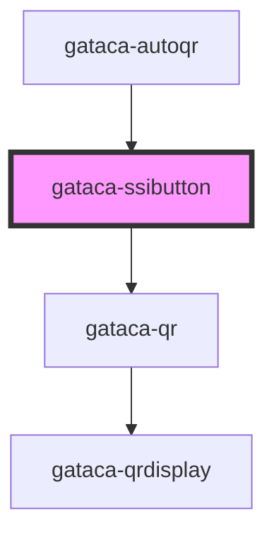

# Gataca-SSIButton

This component built using stencyl allows an easy integration to display a "Quick SSI Access Button", with a similar to the current existing sign-in buttons for OAuth2 providers like Google, Twitter or Facebook.

This component wraps the logic to display and hide a Gataca-QR component under a button. To configure and integrate it, you need to follow the same process as the basic [Gataca-QR component](../gataca-qr/readme.md).

This component can be used with the prerequisite of having an application which can be integrated with GATACA Components: Connect  and Certify. More precisely, your application will need to be able to perform the two operations against your connect or certify servers:

1. Create sessions
2. Consult sessions

## Integrations

### Pure JS

You can include the components by importing the library, available on NPM:

#### Script tag

Put a script tag similar to the source [https://unpkg.com/gatacaqr/dist/gatacaqr.js](https://unpkg.com/gatacaqr/dist/gatacaqr.js) in the head of your index.html. Check for the last version:

```html
<!DOCTYPE html>
<html dir="ltr" lang="en">
<head>
  <meta charset="utf-8">
  <meta name="viewport" content="width=device-width, initial-scale=1.0, minimum-scale=1.0, maximum-scale=5.0">
  <script src='https://unpkg.com/gatacaqr@2.0.0/dist/gatacaqr.js'></script>
</head>
...
</html>
```

#### Example

````html
<!DOCTYPE html>
<html dir="ltr" lang="en">
<head>
  <meta charset="utf-8">
  <meta name="viewport" content="width=device-width, initial-scale=1.0, minimum-scale=1.0, maximum-scale=5.0">
  <title>Gataca SSI Button</title>
  <script type="module" src="/build/gatacaqr.esm.js"></script>
  <script nomodule src="/build/gatacaqr.js"></script>
</head>
<body>

<div>

  
   <gataca-ssibutton id="gataca-qr" qrRole="connect" callback-server="https://connect.gataca.io"> <!-- TODO Change with your connect server-->
  </gataca-ssibutton>

</div>

<script>
  const qr = document.getElementById('gataca-qr');
  var count = 0;
  var ok = true; 

  qr.successCallback = (data) => {
    //TODO Change with what you want to happen when the session is validated
    alert("ALL OK" + data)
  };
  qr.errorCallback = () => {
    //TODO Change with what you want to happen when the session is expired or the user provides invalid credentials
    alert("some error")
  };

  qr.createSession = () => {
    // TODO Change with an invocation to your service to create a session (either v1 or v2)
    // Authentication request is required only for v2
    return { sessionId: "TWp3V2R1N29ZcmFMY3Nvd3ZPb3k0UlMz", authenticationRequest:"" }
  }

  qr.checkStatus = () => {
    //TODO Change with and invocation to your Backend service to query the status of the session
    count++;
    if (count == 10) {
      return { result: ok ? 1 : 2, data: { "name": "test", "token": "x" } }
    }
    return { result: 0 }
  }
</script>

</body>
</html>
````

You can use this component with an already created session, which can be inserted on the sessionId property on the element, or passed via query parameter _id_ or _sessionId_ on the current URL.
You can also provide a method to generate a new session like in the example, or, in the rare event of matching the authorizer API, just the endpoint to your application.

In order to consult sessions, both options are also available, depending on how you want to develop your own API.

### React App Integration

Import the library

```bash
npm install @gataca/qr --save
```

or

```bash
yarn add @gataca/qr
```

In your base file index.js (or index.tsx), include:

```typescript
import { applyPolyfills, defineCustomElements } from '@gataca/qr/loader'

//before ReactDOM.render
applyPolyfills().then(() => {
    defineCustomElements(window)
})

```

The integration would depend if your using a Class Component or a Function Component. Supposing a function component (adaptation to class components is trivial), you would need to include:

````typescript
type MyProps = {
    ...
    verifier?: boolean
    configId?: string
    appToken?: string
}


export const dummyComponent: React.FC<MyProps> = (props) => {
  ...
  const { verifier, appToken, configId } = props
  const qr = useRef(null)
  let gqr: HTMLGatacaQrElement | undefined

  useEffect(() => {
            if (qr != null && qr.current != null) {
                gqr = qr.current! as HTMLGatacaQrElement
                gqr.createSession = createSession
                gqr.checkStatus = checkStatus
                gqr.successCallback = createSessionSuccess
                gqr.errorCallback = createSessionError
        }
    })


    //TODO Implement your own service logic invocation. This is just a dummy mimicking the Connect/Certify v1 APIs asuming you get an app token in props
     const createSession = async (): Promise<{
        sessionId: string
        authenticationRequest?: string
    }> => {
        try {
            let endpoint =
                server +
                (verifier ? '/api/v1/sessions' : '/api/v1/issuanceRequests')
            let response = await fetch(endpoint, {
                method: 'POST',
                headers: {
                    'Content-Type': 'application/json',
                    Authorization: 'jwt ' + appToken,
                },
                body: verifier
                    ? '{"ssiConfigId": "' + configId + '"}'
                    : '{"group": "' + configId + '"}',
            })
            let data = await response.json()
            return { sessionId: data.id! }
        } catch (error) {
            setSessionErrorState(true)
            throw error
        }
    }

    const checkStatus = async (): Promise<{
        result: RESULT_STATUS
        data?: any
    }> => {
        //TODO Implement your own service logic invocation. This is just a dummy mimicking the Connect/Certify v1 APIs asuming you get an app token in props
        if (!appToken || error) {
            gqr?.stop()
        }
        const endpoint =
            server +
            (verifier ? '/api/v1/sessions/' : '/admin/v1/issuanceRequests/') +
            sessionId
        let response = await fetch(endpoint, {
            method: 'GET',
            headers: {
                Authorization: 'jwt ' + appToken,
                'Content-Type': 'application/json',
            },
        })

        if (verifier) {
            let req = await response
            return req.status === 200
                ? { result: RESULT_STATUS.SUCCESS }
                : req.status === 204
                ? { result: RESULT_STATUS.ONGOING }
                : { result: RESULT_STATUS.FAILED }
        } else {
            let req = await response.json()
            return !req.status || req.status === 'PENDING'
                ? { result: RESULT_STATUS.ONGOING }
                : req.status === 'INVALID'
                ? { result: RESULT_STATUS.FAILED }
                : { result: RESULT_STATUS.SUCCESS }
        }
    }

    const createSessionSuccess = (newdata: any) => {
        //TODO Handle success
    }

    const createSessionError = (error: any) => {
        //TODO Handle ERROR
    }

  //render() function in class components
  return (
      // @ts-ignore
      <gataca-ssibutton
          callback-server={ verifier ? YOUR_CONNECT_HOST: YOUR_CERTIFY_HOST }
          ref={qr}
          qr-role={verifier ? "connect":"certify"}
      />
  )
                  
}
````

### Angular App Integration

TBD

<!-- Auto Generated Below -->


## Properties

| Property             | Attribute              | Description                                                                                                                                                                                                                     | Type                                                                    | Default                                                               |
| -------------------- | ---------------------- | ------------------------------------------------------------------------------------------------------------------------------------------------------------------------------------------------------------------------------- | ----------------------------------------------------------------------- | --------------------------------------------------------------------- |
| `autorefresh`        | `autorefresh`          | _[Optional]_ Set to refresh the session automatically upon expiration. By default it is false                                                                                                                                   | `boolean`                                                               | `false`                                                               |
| `buttonText`         | `button-text`          | _[Optional]_ In the case of being a button, modifies its text                                                                                                                                                                   | `string`                                                                | `"Easy login"`                                                        |
| `callbackServer`     | `callback-server`      | ***Mandatory just for V1*** Connect/Certify Server where the wallet will send the data                                                                                                                                          | `string`                                                                | `undefined`                                                           |
| `checkStatus`        | --                     | ***Mandatory*** Check status function to query the current status of the session The function must query a client endpoint to check the status. That endpoint must return an error if the session has expired.                  | `(id?: string) => Promise<{ result: RESULT_STATUS; data?: any; }>`      | `undefined`                                                           |
| `createSession`      | --                     | ***Mandatory*** Create session function to generate a new Session Using V1, it can provide just a session Id Using V2, it must provide also the authentication request. The session Id is the id of the presentation definition | `() => Promise<{ sessionId: string; authenticationRequest?: string; }>` | `undefined`                                                           |
| `dynamicLink`        | `dynamic-link`         | _[Optional]_ Display a link containing a dynamic link to invoke the wallet if closed                                                                                                                                            | `boolean`                                                               | `true`                                                                |
| `errorCallback`      | --                     | ***Mandatory*** Callback fired upon session expired or invalid If not set, session error would not be handled An error containing information will be passed as parameter                                                       | `(error?: Error) => void`                                               | `undefined`                                                           |
| `hideBrandTitle`     | `hide-brand-title`     | _[Optional]_ Boolean to show or not show the gataca brand title                                                                                                                                                                 | `boolean`                                                               | `false`                                                               |
| `pollingFrequency`   | `polling-frequency`    | _[Optional]_ Frequency in seconds to check if the session has been validated                                                                                                                                                    | `number`                                                                | `undefined`                                                           |
| `qrModalDescription` | `qr-modal-description` | _[Optional]_ Modifies the Modal description                                                                                                                                                                                     | `string`                                                                | `"Sign up or sign in by scanning the QR Code with the Gataca Wallet"` |
| `qrModalTitle`       | `qr-modal-title`       | _[Optional]_ Modifies the qr headline title                                                                                                                                                                                     | `string`                                                                | `"Quick Access"`                                                      |
| `qrRole`             | `qr-role`              | ***Mandatory*** Decide if scanning the credential as a verifier to request credentials or as an issuer too issue credentials. Options: connect \| certify                                                                       | `string`                                                                | `undefined`                                                           |
| `sessionTimeout`     | `session-timeout`      | _[Optional]_ Maximum time window to display the session                                                                                                                                                                         | `number`                                                                | `undefined`                                                           |
| `successCallback`    | --                     | ***Mandatory*** Callback fired upon session correctly verified If not set, session validation wouldn't trigger any action The session data and a possible token will be sent as parameters to the callback                      | `(data?: any) => void`                                                  | `undefined`                                                           |
| `v2`                 | `v-2`                  | _[Optional]_ Set to use v2 links. The create session must be providing both an authentication request and a session Id                                                                                                          | `boolean`                                                               | `false`                                                               |


## Events

| Event                  | Description                                                                | Type               |
| ---------------------- | -------------------------------------------------------------------------- | ------------------ |
| `gatacaLoginCompleted` | GatacaLoginCompleted event, triggered with session data upon login success | `CustomEvent<any>` |
| `gatacaLoginFailed`    | GatacaLoginFailed event, triggered with error upon login failure           | `CustomEvent<any>` |


## Methods

### `getSessionData() => Promise<any>`

Retrieve manually the session data on a successful login

#### Returns

Type: `Promise<any>`


## Dependencies

### Used by

 - [gataca-autoqr](../gataca-autoqr)

### Depends on

- [gataca-qr](../gataca-qr)

### Graph


----------------------------------------------

*Built with [StencilJS](https://stenciljs.com/)*
